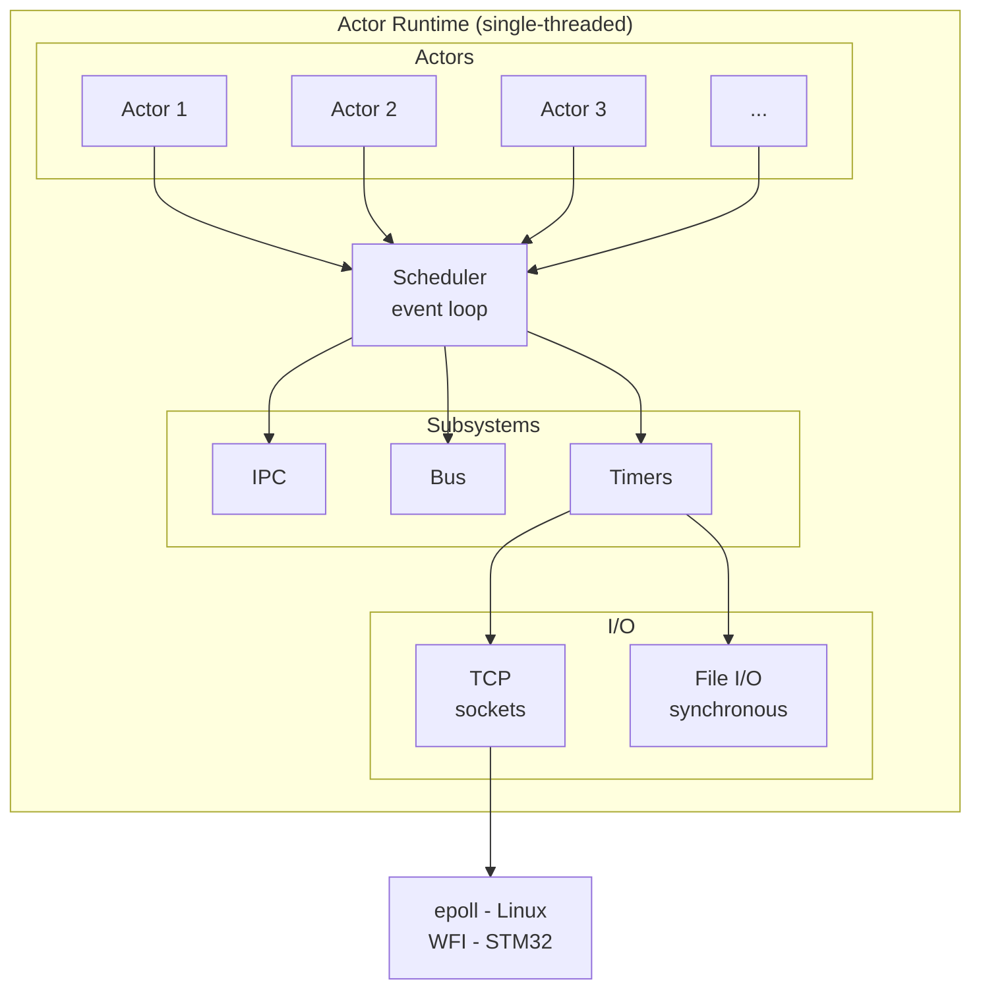

# System Design & Architecture

This document covers the design philosophy, architecture, and guarantees of the Hive actor runtime.

---

## Overview

A minimalistic actor-based runtime designed for **embedded and safety-critical systems**. The runtime implements cooperative multitasking with priority-based scheduling and message passing using the actor model.

**Target use cases** - Drone autopilots, industrial sensor networks, robotics control systems, and other resource-constrained embedded applications requiring structured concurrency.

**Design principles**

1. **Minimalistic**: Only essential features, no bloat
2. **Predictable**: Cooperative scheduling, no surprises
3. **Modern C11**: Clean, safe, standards-compliant code
4. **Statically bounded memory**: All runtime memory is bounded at link time; no heap allocation (see Heap Usage Policy for one optional exception)
5. **O(1) hot paths**: IPC, timers, bus, monitoring, and I/O dispatch use pools with O(1) allocation; spawn/exit may use bounded arena search
6. **No preemption**: Actors run until they block (IPC, I/O, timers) or yield

**Hive favors boundedness and inspectability over fairness and throughput.**

**Note on "bounded"** - Throughout this document, "bounded" refers to **bounded algorithmic complexity and allocation behavior**, not bounded end-to-end response time across actors. Cooperative scheduling means worst-case latency depends on actor behavior.

### Heap Usage Policy

**Definition - Hot path** - Any operation callable while the scheduler is running, including all API calls from actor context, event dispatch, and wakeup processing.

**Allowed heap use** (malloc/free)
- Actor stack allocation during `hive_spawn()` **only if** `actor_config_t.malloc_stack = true`
- Corresponding free on actor exit for malloc'd stacks

**All other heap use is forbidden after `hive_init()` returns.**

**Forbidden heap use** (by subsystem)
- Scheduler and context switching
- All IPC send/receive/select paths
- All timer creation and delivery paths
- All bus publish/read paths
- All name registry operations
- All link/monitor operations
- All I/O event dispatch paths (TCP, file)

**Consequences**
- Hot path operations use **static pools** with **O(1) allocation** and return `HIVE_ERR_NOMEM` on pool exhaustion
- No heap allocation, no fragmentation
- Predictable allocation latency
- Optional malloc'd stacks may fragment the process heap depending on allocator behavior

**Implementation detail** (may change): Stack allocation (spawn/exit) currently uses arena allocator with O(n) first-fit search bounded by number of free blocks, with coalescing on free.

**Linux verification** - Assert no malloc/free after `hive_init()` returns, except stack allocations/frees performed by spawn/exit when `malloc_stack = true`. Use `LD_PRELOAD` malloc wrapper to enforce.

## Target Platforms

**Development** - Linux x86-64

**Production** - STM32 (ARM Cortex-M) bare metal

On both platforms, the actor runtime is **single-threaded** with an event loop architecture. All actors run cooperatively in a single scheduler thread. I/O operations use platform-specific non-blocking mechanisms integrated directly into the scheduler's event loop.

## Guarantees and Non-Guarantees

A clear list of what Hive guarantees and what it does not. Use this to evaluate fit for your application.

### Guaranteed

| Property | Description |
|----------|-------------|
| **Bounded memory** | Total memory usage calculable at link time from compile-time configuration |
| **No hot-path heap** | No malloc/free after `hive_init()` except optional actor stack allocation |
| **Single-threaded** | All actors run in one thread; no data races within runtime |
| **Explicit yields** | Actors run until they explicitly block (recv, select, I/O) or yield |
| **Message ordering** | Messages from A to B delivered in send order (per sender FIFO) |
| **Link/monitor notification** | Actor death notifies linked/monitoring actors unless message pool exhaustion occurs |
| **Timer delivery** | Timers fire after specified delay, delivered as messages to creating actor |
| **Bus latest-value** | Subscribers always read most recent published value (not queued history) |

### Not Guaranteed

| Property | Description |
|----------|-------------|
| **Starvation freedom** | Higher-priority actors can starve lower priority indefinitely |
| **I/O dispatch latency** | If run queue never empties, I/O events may be delayed indefinitely |
| **EXIT delivery under exhaustion** | EXIT uses same pool as IPC; pool exhaustion may drop EXIT messages |
| **Reproducible multi-event order** | When multiple I/O events fire simultaneously, dispatch order is unspecified |
| **Hard real-time deadlines** | No deadline enforcement; worst-case latency depends on actor behavior |
| **Preemption** | Long-running actors are not preempted; must yield cooperatively |

### Honest Positioning

Hive is:
- A **single-threaded, cooperative actor runtime**
- With **Erlang-inspired semantics** (mailboxes, selective receive, links, monitors, supervisors)
- Designed for **MCUs and safety-conscious systems**
- Emphasizing **bounded memory, explicit failure, and predictable scheduling**

Hive is **not**:
- An RTOS (no preemption, no priority inversion protection)
- A hard real-time guarantee engine (no deadline enforcement)
- A distributed actor framework (single process only)
- A statechart or FSM framework

**Tagline** - *"Erlang-style actors in C for embedded systems. Deterministic memory, cooperative scheduling, no GC."*

## Failure Modes Summary

Quick reference for resource exhaustion and failure handling. See IPC and Bus sections in [api.md](api.md) for details.

### Pool Exhaustion Behavior

| Pool | Exhaustion Result | Blocking? | Auto-drop? |
|------|-------------------|-----------|------------|
| IPC message pool | `HIVE_ERR_NOMEM` returned | Optional* | No |
| IPC mailbox entry pool | `HIVE_ERR_NOMEM` returned | Optional* | No |
| Bus message pool | `HIVE_ERR_NOMEM` returned | Optional* | No |
| Bus ring buffer full | Oldest entry evicted | No | Yes (oldest) |
| Bus subscriber table | `HIVE_ERR_NOMEM` returned | No | No |
| Timer pool | `HIVE_ERR_NOMEM` returned | No | No |

*\*Optional blocking via `pool_block` configuration. See [Pool Blocking](#pool-blocking) below.*

**Key insight** - IPC never auto-drops (caller must handle). Bus ring buffer auto-drops oldest entry.

### Pool Blocking

By default, pool exhaustion returns `HIVE_ERR_NOMEM` immediately. Actors can opt into **blocking behavior** where notify/request operations yield (block) until pool space becomes available.

**Configuration:**
- **At spawn**: Set `hive_actor_config_t.pool_block = true`
- **At runtime**: Call `hive_pool_set_block(HIVE_POOL_BLOCK)` or `hive_pool_set_block(HIVE_POOL_NO_BLOCK)`
- **Query**: `hive_pool_get_block()` returns current effective setting

**Behavior when enabled:**
- `hive_ipc_notify()`, `hive_ipc_notify_ex()`, and `hive_bus_publish()` yield instead of returning `HIVE_ERR_NOMEM`
- Actor is added to a **priority-ordered wait queue** (higher priority actors wake first)
- Actor wakes when another actor frees a pool entry (message consumed or actor exits)

**Warning:** Blocking on pool exhaustion can cause **deadlock** if all actors block without any actor freeing pool entries. Use with care - ensure receivers process messages promptly.

### Reserved System Entries

The runtime reserves `HIVE_RESERVED_SYSTEM_ENTRIES` (default: 16) pool entries for **system messages** (TIMER and EXIT). This ensures that:

- **Timer messages** can always be delivered, even when user messages have exhausted the pool
- **Exit notifications** (from links and monitors) can always be delivered

**How it works:**
- User messages (`HIVE_MSG_NOTIFY`, `HIVE_MSG_REQUEST`, `HIVE_MSG_REPLY`) cannot use the last 16 entries
- System messages (`HIVE_MSG_TIMER`, `HIVE_MSG_EXIT`) can use any entry, including reserved ones
- When the pool has only reserved entries remaining, user notifications/requests return `HIVE_ERR_NOMEM` but timers still fire

**Configuration:**
- `HIVE_RESERVED_SYSTEM_ENTRIES` in `hive_static_config.h` (default: 16)
- Setting to 0 disables reservation (system and user messages share the full pool)

**Design rationale:** System messages are critical for runtime correctness. A timer not firing or an exit notification not being delivered could cause actors to hang indefinitely waiting for events that will never arrive.

### Recommended Patterns

| Pattern | When to Use | Example |
|---------|-------------|---------|
| **Check and retry** | Transient exhaustion | `if (NOMEM) sleep_ms(10); retry();` |
| **Backpressure** | Producer-consumer | Use `hive_ipc_request()` (blocks sender) |
| **Pool blocking** | Simple producers | Set `pool_block = true` at spawn |
| **Drop and continue** | Non-critical data | `if (NOMEM) log_warn(); return;` |
| **Escalate** | Critical failure | `if (NOMEM) hive_exit(CRASH);` |

### Error Code Classification

| Error Code | Meaning | Typical Response |
|------------|---------|------------------|
| `HIVE_ERR_TIMEOUT` | Normal control flow | Continue, check condition |
| `HIVE_ERR_WOULDBLOCK` | No data available | Continue, check later |
| `HIVE_ERR_NOMEM` | Pool exhausted | Retry, backoff, or escalate |
| `HIVE_ERR_CLOSED` | Target died | Re-resolve via `hive_whereis()` |
| `HIVE_ERR_INVALID` | Bad arguments | Fix caller (programming error) |

**See** - [IPC API](api.md#ipc-api) and [Bus API](api.md#bus-api) for detailed documentation.

## Design Trade-offs and Sharp Edges

This runtime makes deliberate design choices that favor **predictability, performance, and simplicity** over **ergonomics and safety**. These are not bugs - they are conscious trade-offs suitable for embedded/safety-critical systems with trusted code.

**Accept these consciously before using this runtime**

### 1. Message Lifetime Rule is Sharp and Error-Prone

**Trade-off** - Message payload pointer valid only until next `hive_ipc_recv()` call.

**Why this design**
- Pool reuse: Bounded O(1) allocation, no fragmentation
- Performance: Single pool slot per actor, no reference counting
- Simplicity: No hidden malloc, no garbage collection

**Consequence** - Easy to misuse - storing `msg.data` across recv iterations causes use-after-free.

**This is not beginner-friendly.** Code must copy data immediately if needed beyond current iteration.

**Mitigation** - Documented with WARNING box and correct/incorrect examples in IPC section. But developers will still make mistakes.

**Acceptable if** - You optimize for predictability over ergonomics, and code reviews catch pointer misuse.

---

### 2. No Per-Actor Mailbox Quota (Global Starvation Possible)

**Trade-off** - One slow/malicious actor can consume all mailbox entries, starving the system.

**Why this design**
- Simplicity: No per-actor accounting, no quota enforcement
- Flexibility: Bursty actors can use available pool space
- Performance: No quota checks on notify/request path

**Consequence** - A single bad actor can cause global `HIVE_ERR_NOMEM` failures for all IPC notifications/requests.

**Mitigation** - Application-level quotas, monitoring, backpressure patterns. Runtime provides primitives, not policies.

**Acceptable if** - You deploy trusted code in embedded systems, not untrusted actors in general-purpose systems.

---

### 3. Selective Receive is O(n) per Mailbox Scan

**Trade-off** - Selective receive scans mailbox linearly, which is O(n) where n = mailbox depth.

**Why this design**
- Battle-tested: Proven pattern for building complex protocols
- Simplicity: No index structures, no additional memory overhead
- Flexibility: Any filter criteria supported without pre-registration

**Consequence** - Deep mailboxes slow down selective receive. If 100 messages are queued and you're waiting for a specific tag, each wake scans all 100.

**No save queue optimization** - Unlike Erlang, repeated selective receives with the same filter rescan from the mailbox head each time. There is no "save queue" to track previously scanned messages. If non-matching messages accumulate and are never consumed, this creates O(n) scans on each receive. For embedded systems with small mailboxes, this is acceptable. If this ever becomes a bottleneck, a `scan_start` pointer could be added.

**Keep mailboxes shallow.** The request/reply pattern naturally does this (block waiting for reply).

**Mitigation** - Process messages promptly. Don't let mailbox grow deep. Use `hive_ipc_request()` which blocks until reply.

**Acceptable if** - Typical mailbox depth is small (< 20 messages) and request/reply pattern is followed.

---

### 4. Bus and IPC Share Message Pool (Resource Contention)

**Trade-off** - High-rate bus publishing can starve IPC globally.

**Why this design**
- Simplicity: Single message pool, no subsystem isolation
- Flexibility: Pool space shared dynamically based on actual usage
- Memory efficiency: No wasted dedicated pools

**Consequence** - Misconfigured bus can cause all IPC notifications/requests to fail with `HIVE_ERR_NOMEM`.

**Mitigation** - WARNING box in Bus section, size pool for combined load, monitor exhaustion.

**Acceptable if** - You size pools correctly and monitor resource usage in production.

---

### Summary: This Runtime is a Sharp Tool

These design choices make the runtime:
- **Predictable** - Bounded memory, bounded latency, no hidden allocations
- **Fast** - O(1) hot paths, minimal overhead, zero-copy options
- **Simple** - Minimal code, easy to audit, no complex features
- **Not beginner-friendly** - Sharp edges require careful use
- **Not fault-tolerant** - No automatic isolation, quotas, or recovery

**This is intentional.** The runtime provides primitives for building robust systems, not a complete safe environment.

This runtime provides primitives for predictable embedded performance with full control.

## Architecture



## Scheduling

### Cooperative Model

Actors run until they explicitly yield control. The scheduler reschedules an actor only when:

- The actor calls a blocking I/O primitive (net, file, IPC receive)
- The actor explicitly yields via `hive_yield()`
- The actor exits via `hive_exit()`

There is no preemptive scheduling or time slicing within the actor runtime.

**Reentrancy constraint**
- Runtime APIs are **not reentrant**
- Actors **must not** call runtime APIs from signal handlers or interrupt service routines (ISRs)
- All runtime API calls must occur from actor context (the scheduler thread)
- Violating this constraint results in undefined behavior (data corruption, crashes)

### Actor Blocking Semantics

When an actor calls a blocking API, the following contract applies:

**State transition**
- Actor transitions to `ACTOR_STATE_WAITING` and yields to scheduler
- Actor is removed from run queue (not schedulable until unblocked)
- Scheduler saves actor context and switches to next runnable actor

**Operations that yield (actor gives up CPU, other actors run)**

| Function | Blocks until |
|----------|--------------|
| `hive_yield()` | Immediately reschedules (no wait condition) |
| `hive_ipc_recv()` | Message arrives or timeout (if timeout != 0) |
| `hive_ipc_recv_match()` | Matching message arrives or timeout |
| `hive_ipc_recv_matches()` | Message matching any filter arrives or timeout |
| `hive_ipc_request()` | Reply arrives or timeout |
| `hive_bus_read()` (with timeout) | Bus data available or timeout |
| `hive_tcp_connect()` | Connection established or timeout |
| `hive_tcp_accept()` | Incoming connection or timeout |
| `hive_tcp_send()` | At least 1 byte sent or timeout |
| `hive_tcp_recv()` | At least 1 byte received or timeout |
| `hive_exit()` | Never returns (actor terminates) |

**Non-blocking variants** (return immediately, never yield):
- `hive_ipc_recv()` with timeout = 0 -> returns `HIVE_ERR_WOULDBLOCK` if empty
- `hive_bus_read()` with timeout = 0 -> returns `HIVE_ERR_WOULDBLOCK` if no data

**Note** - File I/O (`hive_file_*`) is NOT in this list. See "Scheduler-Stalling Calls" below.

**Mailbox availability while blocked**
- Blocked actors **can** receive mailbox messages
- Message enqueues are scheduler-owned operations (do not require actor to be runnable)
- Enqueued messages are available when actor unblocks

**Unblock conditions**
- I/O readiness signaled (TCP socket becomes readable/writable)
- Timer expires (for APIs with timeout)
- Message arrives in mailbox (for `hive_ipc_recv()`, `hive_ipc_recv_match()`, `hive_ipc_recv_matches()`, `hive_ipc_request()`)
- Bus data published (for `hive_bus_read()` with non-zero timeout)
- **Important**: Mailbox arrival only unblocks actors blocked in IPC receive operations, not actors blocked on TCP or bus read

**Scheduling phase definition**

A scheduling phase consists of one iteration of the scheduler loop:

1. **Find next runnable actor**: Select highest-priority ready actor (round-robin within priority)
2. **Execute actor**: Run until yield, block, or exit
3. **If no runnable actors**: Call `epoll_wait()` to block until I/O events arrive
4. **Drain epoll events**: Process all returned events before returning to step 1

**Event drain order within a phase**

When `epoll_wait()` returns multiple ready events (timers and TCP), they are processed in **array index order** as returned by the kernel. This order is deterministic for a given set of ready file descriptors but is not controllable by the runtime.

For each event:
- **Timer event (timerfd)**: Read timerfd, send timer tick message to actor's mailbox, wake actor
- **TCP event (socket)**: Perform I/O operation, store result in actor's `io_status`, wake actor

**Event drain timing**
- If runnable actors exist, they run immediately (no `epoll_wait` call)
- `epoll_wait` is only called when the run queue is empty
- All events from a single `epoll_wait` call are drained before selecting the next actor
- This minimizes latency for already-runnable actors at the cost of potentially delayed I/O event processing

**Timeout vs I/O readiness - request state machine**

Each blocking TCP request has an implicit state: `PENDING` -> `COMPLETED` or `TIMED_OUT`.

**State transitions**
- Request starts in `PENDING` when actor blocks on TCP with timeout
- First event processed transitions state out of `PENDING`; subsequent events for same request are **ignored without side effects**

**Tie-break rule (deadline check at wake time)**
- When actor wakes, check: `now >= deadline`?
- If yes: state = `TIMED_OUT`, return `HIVE_ERR_TIMEOUT`, **do not perform I/O even if socket is ready**
- If no: state = `COMPLETED`, perform I/O operation, return result

**Rationale** - This avoids the "read data then discard" oddity. The deadline check is deterministic and independent of epoll event ordering.

**Concrete behavior**
- If I/O ready **before** timeout: Actor wakes, deadline not reached, I/O performed, success
- If timeout **before** I/O ready: Actor wakes, deadline reached, return timeout (no I/O attempted)
- If both fire in **same** `epoll_wait()`: Actor wakes, deadline check determines outcome (I/O not performed if timed out)

**Request serialization (TCP only)**
- Applies to: `hive_tcp_accept()`, `hive_tcp_connect()`, `hive_tcp_recv()`, `hive_tcp_send()` with timeouts
- Constraint: **One outstanding TCP request per actor** (enforced by actor blocking)
- When timeout occurs: epoll registration cleaned up, any late readiness signal is ignored
- New request from same actor gets fresh epoll state

**Note** - This serialization model does NOT apply to:
- **File I/O**: Stalls scheduler synchronously (no event loop involvement)

**Predictability guarantee**

> **Summary** - The runtime has predictable scheduling policy but not reproducible execution order. Given the same epoll event order, scheduling is reproducible; but epoll event order itself is kernel-dependent.

The runtime provides **bounded, predictable behavior**, not full reproducibility:

- **Predictable policy**: Given identical epoll event arrays in identical order, scheduling decisions are reproducible
- **Source of variation**: epoll_wait returns ready file descriptors in kernel-determined order (not sorted, not stable)
- **Consequence**: If multiple FDs become ready simultaneously, their processing order is kernel-dependent
- **What we guarantee**:
  - Bounded memory usage (calculable at link time)
  - Bounded latency (O(1) pool allocation in hot paths)
  - No phantom wakeups (actor only unblocks on specified conditions)
  - Consistent policy (same event order -> same scheduling decisions)
  - **Concrete wake ordering rule**: When processing I/O events from a single `epoll_wait` call, actors made ready are appended to their priority run queues in event processing order. Within a priority level, the run queue is FIFO.
- **What we do NOT guarantee**:
  - Reproducible ordering when multiple timers/sockets fire in the same epoll_wait call
  - Same event dispatch order across kernel versions or system load conditions

**Design choice** - Sorting epoll events by fd/source-id before dispatch would provide reproducibility but adds O(n log n) overhead per epoll_wait. For embedded systems prioritizing latency over reproducibility, this overhead is not justified. Applications requiring reproducible replay should use external event logging.

### Scheduler-Stalling Calls

File I/O operations (`hive_file_read()`, `hive_file_write()`, `hive_file_sync()`) are **synchronous** and briefly pause the scheduler. This is fine for short, bursty operations; typical embedded file writes complete in under 1ms.

**Behavior**
- Calling actor does NOT transition to `ACTOR_STATE_WAITING`
- The scheduler event loop is paused during the syscall
- Other actors wait briefly (no actor runs during file I/O)
- Timer delivery is suspended (timerfd expirations accumulate in kernel)
- After completion: accumulated timer expirations are delivered per tick-coalescing rules

**Why synchronous?**
- Regular files do not work with `epoll` on Linux (always report ready)
- True async file I/O would require `io_uring` (Linux 5.1+) or a thread pool
- For embedded (STM32): FATFS/littlefs operations are typically fast (<1ms)
- Simplicity: no additional complexity for a rarely-needed feature

**Best practices**
- Use `HIVE_PRIORITY_LOW` actors for file work
- Keep operations short (small buffers, brief writes)
- For logging: batch writes or use ring buffers
- Initialization/shutdown: file I/O is fine at any priority (no real-time constraints yet)

**Avoid** - File I/O from `HIVE_PRIORITY_CRITICAL` actors in tight control loops.

**Design alternatives not implemented**
- `io_uring`: Would add Linux 5.1+ dependency and significant complexity
- Thread pool: Contradicts single-threaded design; removed in event loop migration
- DMA with completion interrupt (STM32): Could be added for specific flash/SD drivers

### Priority Levels

Four priority levels, lower value means higher priority:

| Level | Name | Typical Use |
|-------|------|-------------|
| 0 | `HIVE_PRIORITY_CRITICAL` | Flight control loop |
| 1 | `HIVE_PRIORITY_HIGH` | Sensor fusion |
| 2 | `HIVE_PRIORITY_NORMAL` | Telemetry |
| 3 | `HIVE_PRIORITY_LOW` | Logging |

The scheduler always picks the highest-priority runnable actor. Within the same priority level, actors are scheduled round-robin.

**Fairness guarantees**
- Round-robin scheduling within a priority level ensures fairness among actors of equal priority
- The scheduler does **not** guarantee starvation freedom across priority levels
- A continuously runnable high-priority actor can starve lower-priority actors indefinitely
- Applications must design priority hierarchies to avoid starvation scenarios

### Context Switching

Context switching is implemented via manual assembly for performance:

- **x86-64 (Linux)** - Save/restore callee-saved registers (rbx, rbp, r12-r15) and stack pointer
- **ARM Cortex-M (STM32)** - Save/restore callee-saved registers (r4-r11) and stack pointer. On Cortex-M4F and similar with hardware FPU, also saves/restores FPU registers (s16-s31) when `__ARM_FP` is defined.

No use of setjmp/longjmp or ucontext for performance reasons.

## Thread Safety

### Single-Threaded Event Loop Model

The runtime is **completely single-threaded**. All runtime operations execute in a single scheduler thread with an event loop architecture. There are **no I/O worker threads** - all I/O operations are integrated into the scheduler's event loop using platform-specific non-blocking mechanisms.

**Key architectural invariant** - Only one actor executes at any given time. Actors run cooperatively until they explicitly yield (via `hive_yield()`, blocking I/O, or `hive_exit()`). The scheduler then switches to the next runnable actor or waits for I/O events.

### Runtime API Thread Safety Contract

**All runtime APIs must be called from actor context (the scheduler thread)**

| API Category | Thread Safety | Enforcement |
|-------------|---------------|-------------|
| **Actor APIs** (`hive_spawn`, `hive_exit`, etc.) | Single-threaded only | Must call from actor context |
| **IPC APIs** (`hive_ipc_notify`, `hive_ipc_recv`) | Single-threaded only | Must call from actor context |
| **Bus APIs** (`hive_bus_publish`, `hive_bus_read`) | Single-threaded only | Must call from actor context |
| **Timer APIs** (`hive_timer_after`, `hive_timer_every`) | Single-threaded only | Must call from actor context |
| **File APIs** (`hive_file_read`, `hive_file_write`) | Single-threaded only | Must call from actor context; stalls scheduler |
| **TCP APIs** (`hive_tcp_recv`, `hive_tcp_send`) | Single-threaded only | Must call from actor context |

**Forbidden from**
- Signal handlers (not reentrant)
- Interrupt service routines (ISRs on embedded systems)
- External threads (no locking/atomics implemented)

### External Thread Communication Pattern

**Problem** - External threads cannot call runtime APIs directly (no thread safety layer).

**Solution** - Use platform-specific IPC mechanisms with a dedicated reader actor:

```c
// External thread writes to socket/pipe
void external_producer(void) {
    int sock = connect_to_actor_socket();
    write(sock, data, len);  // Platform IPC, not runtime API
}

// Dedicated reader actor bridges external thread -> actors
void socket_reader_actor(void *arg) {
    int sock = listen_and_accept();
    while (1) {
        size_t received;
        hive_tcp_recv(sock, buf, len, &received, -1);  // Blocks in event loop
        hive_ipc_notify(worker, HIVE_TAG_NONE, buf, received);  // Forward to actors
    }
}
```

This pattern is safe because:
- External thread only touches OS-level socket (thread-safe by OS)
- `hive_tcp_recv()` executes in scheduler thread (actor context)
- `hive_ipc_notify()` executes in scheduler thread (actor context)
- No direct runtime state access from external thread

### Synchronization Primitives

The runtime uses **zero synchronization primitives** in the core event loop:

- **No mutexes** - single thread, no contention
- **No C11 atomics** - single writer/reader per data structure
- **No condition variables** - event loop uses epoll for waiting
- **No locks** - mailboxes, actor state, bus state accessed only by scheduler thread

**STM32 exception** - ISR-to-scheduler communication uses `volatile bool` flags with interrupt disable/enable for safe flag clearing. This is a synchronization protocol but not C11 atomics or lock-based synchronization.

**Optional synchronization** (not part of hot path):
- **Logging** - No synchronization needed (single-threaded)

### Rationale

This pure single-threaded model provides:

- **Maximum simplicity** - No lock ordering, no deadlock, trivial to reason about
- **No threading nondeterminism** - No lock contention, no priority inversion, no data races
- **Maximum performance** - Zero lock overhead, no cache line bouncing, no atomic operations
- **Safety-critical friendly** - No threading edge cases (event dispatch order is kernel-dependent, see "Determinism guarantee")
- **Portability** - Works on platforms without pthread support

**Trade-off** - Cannot leverage multiple CPU cores for I/O parallelism. This is acceptable for embedded systems (typically single-core) and simplifies the implementation dramatically.

### Event Loop Architecture

*Terminology: "Event loop" and "scheduler loop" refer to the same construct - the main loop that dispatches I/O events and schedules actors. This document uses "event loop" as the canonical term.*

**Linux**
- Timers: `timerfd` registered in `epoll`
- TCP: Non-blocking sockets registered in `epoll`
- File: Direct synchronous I/O (regular files don't work with epoll anyway)
- Event loop: `epoll_wait()` with bounded timeout (10ms) for defensive wakeup

**Defensive timeout rationale** - The 10ms bounded timeout guards against lost wakeups, misconfigured epoll registrations, or unexpected platform behavior. It is not required for correctness under ideal conditions but provides a safety net against programming errors or kernel edge cases.

**STM32 (bare metal)**
- Timers: Hardware timers (SysTick or TIM peripherals)
- TCP: Not yet implemented (planned: lwIP in NO_SYS mode)
- File: Flash-backed virtual files with ring buffer (see [File API](api.md#file-api))
- Event loop: WFI (Wait For Interrupt) when no actors runnable

**Key insight** - Modern OSes provide non-blocking I/O mechanisms (epoll, kqueue, IOCP). On bare metal, hardware interrupts and WFI provide equivalent functionality. The event loop pattern is standard in async runtimes (Node.js, Tokio, libuv, asyncio).

See [Event Loop Architecture (Implementation)](internals.md#event-loop-architecture) for detailed implementation with code examples.

## Memory Model

### Actor Stacks

Each actor has a fixed-size stack allocated at spawn time. Stack size is configurable per actor via `actor_config_t.stack_size`, with a system-wide default (`HIVE_DEFAULT_STACK_SIZE`). Different actors can use different stack sizes to optimize memory usage.

Stack growth/reallocation is not supported. Stack overflow results in undefined behavior - proper stack sizing is required (see [Stack Overflow](internals.md#stack-overflow) section).

### Memory Allocation

The runtime uses static allocation for predictable behavior and suitability for MCU deployment. All memory regions are statically reserved at compile time; allocation within those regions occurs at runtime via bounded algorithms.

**Key characteristics**
- No heap allocation after `hive_init()` except optional malloc for actor stacks
- O(1) pool allocation for hot paths (IPC, timers, bus)
- O(n) bounded arena allocation for cold paths (spawn/exit)
- Pool exhaustion returns `HIVE_ERR_NOMEM`

See [Heap Usage Policy](#heap-usage-policy) for the complete contract and [Memory Allocation Architecture](internals.md#memory-allocation-architecture) for compile-time configuration, pool sizes, and memory sizing guide.

## Architectural Limits

The following limits are **hardcoded** and cannot be changed without modifying the runtime source code. They differ from compile-time configurable limits (like `HIVE_MAX_ACTORS`) which can be adjusted via preprocessor defines.

| Limit | Value | Reason | Location |
|-------|-------|--------|----------|
| Bus subscribers | 32 max | `uint32_t` bitmask tracks which subscribers read each entry | `hive_bus.c` |
| Priority levels | 4 (0-3) | Enum: CRITICAL=0, HIGH=1, NORMAL=2, LOW=3 | `hive_types.h` |
| Message header | 4 bytes | Wire format: class (4 bits) + gen (1 bit) + tag (27 bits) | `hive_ipc.c` |
| Tag values | 27 bits | 134M unique values before wrap; bit 27 marks generated tags | `hive_ipc.c` |
| Message classes | 6 | NOTIFY, REQUEST, REPLY, TIMER, EXIT, ANY (4-bit field) | `hive_types.h` |

**Bus subscriber limit (32)** - Each bus entry has a `uint32_t readers_mask` bitmask where bit N indicates subscriber N has read the entry. This enables O(1) read tracking per entry. Enforced by `_Static_assert` in `hive_bus.c`.

**Configurable limits** (via `hive_static_config.h`, recompile required):
- `HIVE_MAX_ACTORS` (64) - maximum concurrent actors
- `HIVE_MAX_BUSES` (32) - maximum concurrent buses
- `HIVE_MAX_BUS_ENTRIES` (64) - entries per bus ring buffer
- `HIVE_MAX_BUS_SUBSCRIBERS` (32) - subscribers per bus (capped by architectural limit)
- `HIVE_MAILBOX_ENTRY_POOL_SIZE` (256) - global mailbox entry pool
- `HIVE_MESSAGE_DATA_POOL_SIZE` (256) - global message data pool
- `HIVE_MAX_MESSAGE_SIZE` (256) - maximum message size including header
- `HIVE_STACK_ARENA_SIZE` (1 MB) - actor stack arena
- `HIVE_DEFAULT_STACK_SIZE` (64 KB) - default actor stack size

## Error Handling

All runtime functions return `hive_status_t`:

```c
typedef enum {
    HIVE_OK = 0,
    HIVE_ERR_NOMEM,
    HIVE_ERR_INVALID,
    HIVE_ERR_TIMEOUT,
    HIVE_ERR_CLOSED,
    HIVE_ERR_WOULDBLOCK,
    HIVE_ERR_IO,
} hive_error_code_t;

typedef struct {
    hive_error_code_t code;
    const char    *msg;   // string literal or NULL, never heap-allocated
} hive_status_t;
```

The `msg` field always points to a string literal or is NULL. It is never dynamically allocated, ensuring safe use across concurrent actors.

Convenience macros:

```c
#define HIVE_SUCCESS ((hive_status_t){HIVE_OK, NULL})
#define HIVE_SUCCEEDED(s) ((s).code == HIVE_OK)
#define HIVE_FAILED(s) ((s).code != HIVE_OK)
#define HIVE_ERROR(code, msg) ((hive_status_t){(code), (msg)})
#define HIVE_ERR_STR(s) ((s).msg ? (s).msg : "unknown error")
```

Usage example:
```c
if (len > HIVE_MAX_MESSAGE_SIZE) {
    return HIVE_ERROR(HIVE_ERR_INVALID, "Message too large");
}
```

### Actor Exit Semantics

**Returning from actor function = NORMAL (Erlang semantics)**

If an actor's entry function returns without calling `hive_exit()`, the runtime treats this as normal termination (`HIVE_EXIT_REASON_NORMAL`). This follows Erlang semantics where a process with no more code to execute terminates normally.

```c
void my_actor(void *args, const hive_spawn_info_t *siblings, size_t count) {
    // OK: returning = HIVE_EXIT_REASON_NORMAL (Erlang semantics)
    // Just let the function end, or use explicit return:
    // return;

    // To signal failure:
    // hive_exit(HIVE_EXIT_REASON_CRASH);

    // App-defined exit reason:
    // hive_exit(42);
}
```

**Error codes are not crash conditions**

| Error Code | Meaning | Typical Response |
|------------|---------|------------------|
| `HIVE_ERR_TIMEOUT` | Operation timed out | Normal control flow (retry, fallback, continue) |
| `HIVE_ERR_WOULDBLOCK` | Non-blocking operation has no data | Normal control flow (try again later) |
| `HIVE_ERR_NOMEM` | Pool exhausted | **Systemic error** - log, backoff, or escalate |
| `HIVE_ERR_CLOSED` | Target actor died | Handle gracefully (re-resolve via whereis) |
| `HIVE_ERR_INVALID` | Invalid arguments | Bug in caller - fix the code |
| `HIVE_ERR_IO` | I/O operation failed | Depends on context (retry, report, abort) |

**`HIVE_ERR_TIMEOUT` is not a crash.** Many legitimate patterns use timeouts for control flow (deadman watchdogs, periodic polling, request timeouts). Do not treat timeout as an error requiring actor termination.

**`HIVE_ERR_NOMEM` indicates systemic overload.** Unlike timeout, NOMEM means the system is misconfigured or overloaded. Appropriate responses:
- Log the error for diagnosis
- Apply backpressure (slow down, drop work)
- Escalate to supervisor (if transient issue)
- Shut down gracefully (if persistent)
