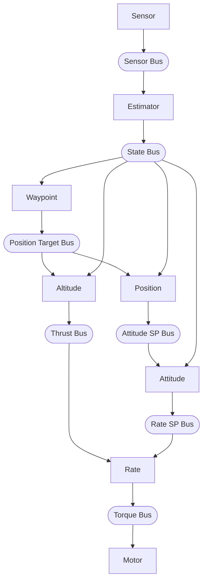

# Pilot Example

Quadcopter waypoint navigation using hive actor runtime.

Supports three platforms:
- **Webots simulation** (default) - Crazyflie quadcopter in Webots simulator
- **Crazyflie 2.1+** - Bitcraze nano quadcopter (~39 KB flash, ~140 KB RAM)
- **STEVAL-DRONE01** - ST mini drone kit (~60 KB flash, ~57 KB RAM)

## What it does

Demonstrates waypoint navigation with a quadcopter using 9 actors:

1. **Sensor actor** reads raw sensors via HAL, publishes to sensor bus
2. **Estimator actor** runs complementary filter, computes velocities, publishes to state bus
3. **Altitude actor** reads target altitude from position target bus, runs altitude PID
4. **Waypoint actor** waits for START signal, manages waypoint list, publishes to position target bus
5. **Position actor** reads target XY/yaw from position target bus, runs position PD
6. **Attitude actor** runs attitude PIDs, publishes rate setpoints
7. **Rate actor** runs rate PIDs, publishes torque commands
8. **Motor actor** reads torque bus, writes to hardware via HAL (checks for STOP signal)
9. **Supervisor actor** handles startup delay (60s), sends START/STOP notifications

**Webots:** Flies a square pattern with altitude changes at each waypoint (full 3D navigation with GPS).

**Crazyflie 2.1+:** With Flow deck v2, uses optical flow for XY positioning and ToF for altitude.
Without Flow deck, hovers and changes altitude only. 60-second startup delay before flight.

**STEVAL-DRONE01:** Hovers and changes altitude only (no GPS, so XY position fixed at origin).
60-second startup delay before flight.

**Safety features (all platforms):** Emergency cutoff on excessive tilt (>45°), excessive
altitude (>2m), or touchdown. Flight duration limited by supervisor (10s/40s/60s per profile).

## Prerequisites

**For Webots simulation:**
- Webots installed (https://cyberbotics.com/)

**For Crazyflie 2.1+ / STEVAL-DRONE01:**
- ARM GCC: `apt install gcc-arm-none-eabi`
- ST-Link: `apt install stlink-tools`
- Debug adapter (Bitcraze debug adapter for Crazyflie, or ST-Link for STEVAL)

## Build and Run

### Webots Simulation

```bash
export WEBOTS_HOME=/usr/local/webots  # adjust path
make
make install
```

Then open `worlds/hover_test.wbt` in Webots and start the simulation.

### Crazyflie 2.1+

```bash
make -f Makefile.crazyflie-2.1+        # Build firmware (~39 KB flash)
make -f Makefile.crazyflie-2.1+ flash  # Flash via debug adapter
make -f Makefile.crazyflie-2.1+ clean  # Clean build artifacts
```

**Hardware:**
- MCU: STM32F405RG (168 MHz Cortex-M4F, 1 MB flash, 192 KB RAM + 64 KB CCM)
- IMU: BMI088 (3-axis accel + 3-axis gyro)
- Barometer: BMP388
- Optional: Flow deck v2 (PMW3901 optical flow + VL53L1x ToF)

**Flight profiles:** Select with `make FLIGHT_PROFILE=N`:
- `1` (FIRST_TEST) - Hover at 0.5m, 10s flight, then land (default)
- `2` (ALTITUDE) - Altitude changes only: 0.5m → 1.0m → 1.5m → repeat
- `3` (FULL_3D) - Full 3D navigation (requires Flow deck)

Debug via SWD using Bitcraze debug adapter. Connect to 0.05" debug header on Crazyflie.

### STEVAL-DRONE01

```bash
make -f Makefile.STEVAL-DRONE01        # Build firmware (~60 KB flash, ~57 KB RAM)
make -f Makefile.STEVAL-DRONE01 flash  # Flash to device via ST-Link
make -f Makefile.STEVAL-DRONE01 clean  # Clean build artifacts
```

**Flight profiles:** Select with `make FLIGHT_PROFILE=N`:
- `1` (FIRST_TEST) - Hover at 0.5m, 10s flight, then land (default)
- `2` (ALTITUDE) - Altitude changes only: 0.5m → 1.0m → 1.5m → repeat
- `3` (FULL_3D) - Full 3D waypoint navigation (no GPS, so limited use)

Memory fits STM32F401CCU6 (256 KB flash, 64 KB RAM) with ~7 KB RAM headroom.

Debug output via USART1 (115200 baud) on the P7 header. See
`hal/STEVAL-DRONE01/README.md` for hardware details and serial connection.

## Files

### Application Code

| File | Description |
|------|-------------|
| `pilot.c` | Main entry point, bus setup, actor spawn |
| `sensor_actor.c/h` | Reads sensors via HAL → sensor bus |
| `estimator_actor.c/h` | Sensor fusion → state bus |
| `altitude_actor.c/h` | Altitude PID → thrust |
| `waypoint_actor.c/h` | Waypoint manager → position target bus |
| `position_actor.c/h` | Position PD → attitude setpoints |
| `attitude_actor.c/h` | Attitude PIDs → rate setpoints |
| `rate_actor.c/h` | Rate PIDs → torque commands |
| `motor_actor.c/h` | Output: torque → HAL → motors |
| `supervisor_actor.c/h` | Startup delay, flight window cutoff |
| `pid.c/h` | Reusable PID controller |
| `fusion/complementary_filter.c/h` | Portable attitude estimation (accel+gyro fusion) |
| `types.h` | Shared data types (sensor_data_t, state_estimate_t, etc.) |
| `config.h` | Shared constants (PID gains, timing, limits) |

### Build System

| File | Description |
|------|-------------|
| `Makefile` | Webots simulation build |
| `Makefile.crazyflie-2.1+` | Crazyflie 2.1+ build (STM32F405, 168 MHz) |
| `Makefile.STEVAL-DRONE01` | STEVAL-DRONE01 build (STM32F401, 84 MHz) |

### Documentation

| File | Description |
|------|-------------|
| `README.md` | This file |
| `SPEC.md` | Detailed design specification |

### Directories

| Directory | Description |
|-----------|-------------|
| `hal/` | Hardware abstraction layer (common interface in `hal.h`) |
| `hal/webots-crazyflie/` | HAL implementation for Webots simulation |
| `hal/crazyflie-2.1+/` | HAL implementation for Crazyflie 2.1+ (BMI088, BMP388, Flow deck) |
| `hal/STEVAL-DRONE01/` | HAL implementation for STEVAL-DRONE01 (LSM6DSL, LPS22HH) |
| `controllers/pilot/` | Webots controller (symlink created by `make install`) |
| `worlds/` | Webots world files (hover_test.wbt) |

## Architecture

Nine actors connected via buses:



Hardware Abstraction Layer (HAL) provides platform independence:
- `hal_read_sensors()` - reads sensors (called by sensor_actor)
- `hal_write_torque()` - writes motors with mixing (called by motor_actor)

HAL implementations:
- `hal/webots-crazyflie/hal_webots.c` - Webots simulation
- `hal/crazyflie-2.1+/hal_crazyflie.c` - Crazyflie 2.1+ hardware
- `hal/STEVAL-DRONE01/hal_stm32.c` - STEVAL-DRONE01 hardware

Actor code is identical across platforms. The only compile-time difference is
`SIMULATED_TIME` which controls the main loop (simulation vs real-time).

## Actor Priorities and Spawn Order

All actors run at CRITICAL priority. Spawn order determines execution order
within the same priority level (round-robin). Actors are spawned in data-flow
order to ensure each actor sees fresh data from upstream actors in the same step:

| Order | Actor     | Priority | Rationale |
|-------|-----------|----------|-----------|
| 1     | sensor    | CRITICAL | Reads hardware first |
| 2     | estimator | CRITICAL | Needs sensors, produces state estimate |
| 3     | altitude  | CRITICAL | Needs state, produces thrust |
| 4     | waypoint  | CRITICAL | Needs state + START signal, produces position targets |
| 5     | position  | CRITICAL | Needs target, produces attitude setpoints |
| 6     | attitude  | CRITICAL | Needs attitude setpoints, produces rate setpoints |
| 7     | rate      | CRITICAL | Needs state + thrust + rate setpoints |
| 8     | motor     | CRITICAL | Needs torque + STOP signal, writes hardware last |
| 9     | supervisor| CRITICAL | Sends START to waypoint, STOP to motor after flight window |

## Control System

### PID Controllers (tuned in hal_config.h per platform)

Webots gains shown below; STEVAL-DRONE01 uses higher altitude gains (Kp=0.5, Ki=0.1).

| Controller | Kp   | Ki   | Kd    | Purpose |
|------------|------|------|-------|---------|
| Altitude   | 0.3  | 0.05 | 0     | Track target altitude (PI + velocity damping) |
| Position   | 0.2  | -    | 0.1   | Track target XY (PD, max tilt 0.35 rad) |
| Attitude   | 4.0  | 0    | 0     | Level attitude (roll/pitch) |
| Yaw attitude | 4.0 | 0   | 0     | Track target heading (uses pid_update_angle for wrap-around) |
| Roll rate  | 0.02 | 0    | 0.001 | Stabilize roll |
| Pitch rate | 0.02 | 0    | 0.001 | Stabilize pitch |
| Yaw rate   | 0.02 | 0    | 0.001 | Stabilize yaw |

Altitude control uses measured vertical velocity for damping (Kv=0.15) instead
of differentiating position error. This provides smoother response with less noise.

Position control uses simple PD with velocity damping. Commands are transformed
from world frame to body frame based on current yaw. Heading hold is achieved
via yaw attitude setpoint published to the attitude actor, which uses `pid_update_angle()`
to handle the ±π wrap-around correctly.

### Waypoint Navigation

The waypoint actor manages a list of waypoints and publishes the current target
to the position target bus. Both altitude and position actors read from this bus.

**Webots demo route (square pattern with altitude changes):**
1. (0, 0, 1.0m) heading 0° - start at 1m
2. (1, 0, 1.2m) heading 0° - rise to 1.2m
3. (1, 1, 1.4m) heading 90° - rise to 1.4m, face east
4. (0, 1, 1.2m) heading 180° - drop to 1.2m, face south
5. (0, 0, 1.0m) heading 0° - return to 1m

**Crazyflie 2.1+ / STEVAL-DRONE01 demo route (altitude only):**
1. 0.5m - hover at 0.5m
2. 1.0m - rise to 1.0m
3. 1.5m - rise to 1.5m
4. 1.0m - drop to 1.0m (loop back to 1)

With Flow deck, Crazyflie can also use the Webots route for full 3D navigation.

**First flight test route (FLIGHT_PROFILE=1, safe tethered test):**
1. Hover at 0.5m for 6 seconds
2. Land after 10 seconds total flight time

**Arrival detection:** The drone must satisfy all conditions before advancing:
- XY position within 0.15m of waypoint (Webots, or Crazyflie with Flow deck)
- Altitude within 0.15m of target
- Heading within 0.1 rad (~6°) of target
- Velocity below 0.1 m/s (nearly stopped)
- Hover at waypoint: 2s (simulation), 5s (hardware), 6s (first flight test)

After completing the route, the drone loops back to the first waypoint and repeats forever.

### Motor Mixer (Platform-Specific, X Configuration)

The mixer converts torque commands to individual motor speeds. Each HAL
implementation contains its own mixer. All platforms use X-configuration.

**Webots Crazyflie (hal/webots-crazyflie/):** Matches Bitcraze firmware
```
        Front
      M2    M3
        +--+
        |  |
        +--+
      M1    M4
        Rear

M1 = thrust - roll + pitch + yaw  (rear-left, CCW)
M2 = thrust - roll - pitch - yaw  (front-left, CW)
M3 = thrust + roll - pitch + yaw  (front-right, CCW)
M4 = thrust + roll + pitch - yaw  (rear-right, CW)
```

**Crazyflie 2.1+ (hal/crazyflie-2.1+/):** Brushed coreless motors on TIM2
```
        Front
      M1    M2
        +--+
        |  |
        +--+
      M4    M3
        Rear

M1 = thrust - roll + pitch + yaw  (front-left, CCW)  → TIM2_CH1 (PA0)
M2 = thrust + roll + pitch - yaw  (front-right, CW)  → TIM2_CH2 (PA1)
M3 = thrust + roll - pitch + yaw  (rear-right, CCW)  → TIM2_CH3 (PA2)
M4 = thrust - roll - pitch - yaw  (rear-left, CW)    → TIM2_CH4 (PA3)
```

**STEVAL-DRONE01 (hal/STEVAL-DRONE01/):** Brushed DC motors on TIM4
```
        Front
      M2    M3
        +--+
        |  |
        +--+
      M1    M4
        Rear

M1 = thrust - roll - pitch + yaw  (rear-left, CCW)   → P1 (TIM4_CH1, PB6)
M2 = thrust - roll + pitch - yaw  (front-left, CW)   → P2 (TIM4_CH2, PB7)
M3 = thrust + roll + pitch + yaw  (front-right, CCW) → P4 (TIM4_CH3, PB8)
M4 = thrust + roll - pitch - yaw  (rear-right, CW)   → P5 (TIM4_CH4, PB9)
```

Note: STEVAL board connectors are labeled P1, P2, P4, P5 (no P3).

The mixer is implemented in each HAL's `hal_write_torque()` function.

## Main Loop

The main loop is minimal - all logic is in actors:

```c
while (hal_step()) {
    hive_advance_time(HAL_TIME_STEP_US);  // Advance simulation time, fire due timers
    hive_run_until_blocked();              // Run actors until all blocked
}
```

Webots controls time via `hal_step()` (which wraps `wb_robot_step()`). Each call:
1. Blocks until Webots simulates TIME_STEP milliseconds
2. Returns, `hive_advance_time()` fires due timers
3. `hive_run_until_blocked()` runs all ready actors
4. Actors read sensors, compute, publish results
5. Loop repeats

## Webots Device Names

| Device | Name | Type |
|--------|------|------|
| Motor 1 (rear-left) | `m1_motor` | RotationalMotor |
| Motor 2 (front-left) | `m2_motor` | RotationalMotor |
| Motor 3 (front-right) | `m3_motor` | RotationalMotor |
| Motor 4 (rear-right) | `m4_motor` | RotationalMotor |
| Gyroscope | `gyro` | Gyro |
| Inertial Unit | `inertial_unit` | InertialUnit |
| GPS | `gps` | GPS |
