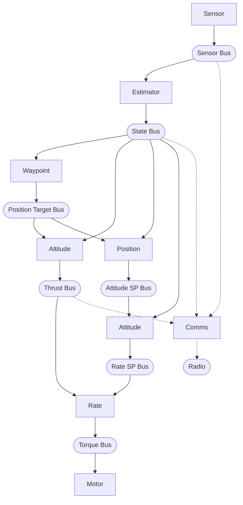

# Pilot Example

Quadcopter waypoint navigation using hive actor runtime.

Supports two platforms:
- **Webots simulation** (default) - Crazyflie quadcopter in Webots simulator
- **Crazyflie 2.1+** - Bitcraze nano quadcopter (~63 KB flash, ~120 KB RAM)

## What it does

Demonstrates waypoint navigation with a quadcopter using 10-12 actors (9-11 workers + 1 supervisor):

1. **Sensor actor** reads raw sensors via HAL, publishes to sensor bus
2. **Estimator actor** runs complementary filter, computes velocities, publishes to state bus
3. **Altitude actor** reads target altitude from position target bus, runs altitude PID, handles landing
4. **Waypoint actor** waits for START signal, manages waypoint list, publishes to position target bus
5. **Position actor** reads target XY/yaw from position target bus, runs position PD
6. **Attitude actor** runs attitude PIDs, publishes rate setpoints
7. **Rate actor** runs rate PIDs, publishes torque commands
8. **Motor actor** reads torque bus, writes to hardware via HAL (checks for STOP signal)
9. **Flight manager actor** handles startup delay (60s), landing coordination, log file management
10. **Comms actor** (Crazyflie only) sends flight data over radio at 100Hz for ground station logging
11. **Telemetry logger actor** (Webots only) writes CSV at 25Hz for PID tuning analysis
12. **Supervisor actor** monitors all workers, restarts flight-critical actors on crash (ONE_FOR_ALL)

Workers use `hive_find_sibling()` for IPC coordination via sibling info passed
by the supervisor at spawn time.

**Webots:** Flies a square pattern with altitude changes at each waypoint (full 3D navigation with GPS).

**Crazyflie 2.1+:** With Flow deck v2, uses optical flow for XY positioning and ToF for altitude.
Without Flow deck, hovers and changes altitude only. 60-second startup delay before flight.
Radio telemetry enabled via Crazyradio 2.0 for real-time ground station logging.

**Safety features (all platforms):** Emergency cutoff on excessive tilt (>45°), excessive
altitude (>2m), or touchdown. Flight duration limited by flight manager (10s/40s/60s per profile).

## Prerequisites

**For Webots simulation:**
- Webots installed (https://cyberbotics.com/)

**For Crazyflie 2.1+:**
- ARM GCC: `apt install gcc-arm-none-eabi`
- ST-Link: `apt install stlink-tools`
- Debug adapter (Bitcraze debug adapter)

## Build and Run

### Webots Simulation

```bash
export WEBOTS_HOME=/usr/local/webots  # adjust path
make                                   # builds and auto-installs to Webots
```

Then open `worlds/hover_test.wbt` in Webots and start the simulation.

Note: `make` automatically installs to the Webots controllers/ directory. This ensures
Webots always runs the latest controller (Webots caches the binary otherwise).

### STM32 Hardware (Crazyflie 2.1+)

```bash
make -f Makefile.<platform>        # Build firmware
make -f Makefile.<platform> flash  # Flash via debug adapter
make -f Makefile.<platform> clean  # Clean build artifacts
```

See `hal/<platform>/README.md` for hardware details, pin mapping, and flight profiles.

## Files

### Application Code

| File | Description |
|------|-------------|
| `pilot.c` | Main entry point, bus setup, supervisor config |
| `sensor_actor.c/h` | Reads sensors via HAL → sensor bus |
| `estimator_actor.c/h` | Sensor fusion → state bus |
| `altitude_actor.c/h` | Altitude PID → thrust |
| `waypoint_actor.c/h` | Waypoint manager → position target bus |
| `position_actor.c/h` | Position PD → attitude setpoints |
| `attitude_actor.c/h` | Attitude PIDs → rate setpoints |
| `rate_actor.c/h` | Rate PIDs → torque commands |
| `motor_actor.c/h` | Output: torque → HAL → motors |
| `flight_manager_actor.c/h` | Startup delay, flight window cutoff |
| `comms_actor.c/h` | Radio telemetry (Crazyflie only) |
| `telemetry_logger_actor.c/h` | CSV logging for PID tuning (Webots only) |
| `pid.c/h` | Reusable PID controller |
| `fusion/complementary_filter.c/h` | Portable attitude estimation (accel+gyro fusion) |
| `types.h` | Shared data types (sensor_data_t, state_estimate_t, etc.) |
| `config.h` | Configuration constants (timing, thresholds, bus config) |
| `math_utils.h` | Math macros (CLAMPF, LPF, NORMALIZE_ANGLE) |
| `notifications.h` | IPC notification tags (NOTIFY_FLIGHT_START, etc.) |
| `flight_profiles.h` | Waypoint definitions per flight profile |

### Build System

| File | Description |
|------|-------------|
| `Makefile` | Webots simulation build |
| `Makefile.crazyflie-2.1+` | Crazyflie 2.1+ build (STM32F405, 168 MHz) |
| `hive_config.mk` | Shared Hive memory config (included by all Makefiles) |

### Configuration

| File | Description |
|------|-------------|
| `config.h` | Configuration constants (timing, thresholds, bus config) |
| `math_utils.h` | Math macros (CLAMPF, LPF, NORMALIZE_ANGLE) |
| `notifications.h` | IPC notification tags (NOTIFY_FLIGHT_START, etc.) |
| `flight_profiles.h` | Waypoint definitions per flight profile |
| `hive_config.mk` | Shared Hive memory limits (actors, buses, pools) |
| `hal/<platform>/hal_config.h` | Platform-specific PID gains and thrust |

Hive memory settings (actors, buses, pool sizes) are determined by the pilot
application and shared across all platforms via `hive_config.mk`. Only stack
sizes differ per platform based on available RAM.

### Analysis Tools

| File | Description |
|------|-------------|
| `tools/analyze_pid.py` | PID metrics analysis (overshoot, rise time, settling time) |
| `tools/plot_telemetry.py` | 6-panel telemetry visualization |
| `tools/plot_flight.py` | Full flight summary with 3D trajectory |
| `tools/ground_station.py` | Radio telemetry receiver (Crazyflie only) |
| `tools/README.md` | Tools documentation and PID tuning workflow |

### Documentation

| File | Description |
|------|-------------|
| `README.md` | This file |
| `SPEC.md` | Detailed design specification |
| `FIRST_FLIGHT_CHECKLIST.md` | Hardware bring-up and first flight guide |

### Directories

| Directory | Description |
|-----------|-------------|
| `hal/` | Hardware abstraction layer (see `hal/<platform>/README.md`) |
| `hal/crazyflie-2.1+/bringup/` | Hardware bring-up test firmware |
| `hal/crazyflie-2.1+/tests/` | HAL test firmware |
| `tools/` | PID tuning and telemetry analysis tools |
| `controllers/pilot/` | Webots controller (installed by `make`) |
| `worlds/` | Webots world files |
| `fusion/` | Portable sensor fusion algorithms |

## Architecture

Ten to twelve actors: nine flight-critical workers connected via buses, one supervisor
monitoring all workers, plus optional telemetry actors (comms on Crazyflie, telemetry_logger on Webots):



Hardware Abstraction Layer (HAL) provides platform independence:
- `hal_read_sensors()` - reads sensors (called by sensor_actor)
- `hal_write_torque()` - writes motors with mixing (called by motor_actor)
- `hal_radio_*()` - radio telemetry (Crazyflie only, called by comms_actor)

Actor code is identical across platforms. See `hal/<platform>/README.md` for
hardware-specific details.

## Supervision and Spawn Order

All actors are supervised with **ONE_FOR_ALL** strategy. Flight-critical actors
use PERMANENT restart (crash triggers restart of all). Comms uses TEMPORARY
restart (crash/exit doesn't trigger restarts, just stops comms).

Workers run at CRITICAL priority (comms at LOW). Spawn order determines
execution order within the same priority level (round-robin). Workers are spawned
in data-flow order, with flight_manager last so all siblings are available via
`hive_find_sibling()`:

| Order | Actor     | Priority | Restart   | Rationale |
|-------|-----------|----------|-----------|-----------|
| 1     | sensor    | CRITICAL | PERMANENT | Reads hardware first |
| 2     | estimator | CRITICAL | PERMANENT | Needs sensors, produces state estimate |
| 3     | waypoint  | CRITICAL | PERMANENT | Needs state + START signal, produces position targets |
| 4     | altitude  | CRITICAL | PERMANENT | Needs state, produces thrust |
| 5     | position  | CRITICAL | PERMANENT | Needs target, produces attitude setpoints |
| 6     | attitude  | CRITICAL | PERMANENT | Needs attitude setpoints, produces rate setpoints |
| 7     | rate      | CRITICAL | PERMANENT | Needs state + thrust + rate setpoints |
| 8     | motor     | CRITICAL | PERMANENT | Needs torque + STOP signal, writes hardware last |
| 9     | flight_mgr| CRITICAL | TRANSIENT | Normal exit = mission complete |
| 10    | comms     | LOW      | TEMPORARY | Crazyflie only, not flight-critical |
| 11    | tlog      | LOW      | TEMPORARY | Webots only, CSV logging for PID tuning |

Workers use **sibling info** for IPC coordination:
- Supervisor passes sibling info (actor IDs and names) at spawn time
- `flight_manager` uses `hive_find_sibling()` to look up waypoint, altitude, motor

## Control System

### PID Controllers

Gains are tuned per platform in `hal/<platform>/hal_config.h`. The control
cascade is: altitude → position → attitude → rate → motors.

- **Altitude:** PI with velocity damping (tracks target altitude)
- **Position:** PD with velocity damping (tracks target XY, max tilt limited)
- **Attitude:** P controller for roll/pitch/yaw angles
- **Rate:** PD controller for angular rates

### Waypoint Navigation

The waypoint actor manages a list of waypoints and publishes the current target
to the position target bus. Both altitude and position actors read from this bus.

Routes depend on flight profile (`FLIGHT_PROFILE=N` at build time) and platform
capabilities. See `hal/<platform>/README.md` for available flight profiles.

**Arrival detection:** Position within 0.15m, heading within 0.1 rad, velocity below 0.05 m/s.
After completing the route, the drone loops back to the first waypoint.

### Motor Mixer

Each HAL implements its own X-configuration mixer in `hal_write_torque()`.
See `hal/<platform>/README.md` for motor layout and mixing equations.

## Main Loop

The main loop is minimal - all logic is in actors:

```c
while (hal_step()) {
    hive_advance_time(HAL_TIME_STEP_US);  // Advance simulation time, fire due timers
    hive_run_until_blocked();              // Run actors until all blocked
}
```

Webots controls time via `hal_step()` (which wraps `wb_robot_step()`). Each call:
1. Blocks until Webots simulates TIME_STEP milliseconds
2. Returns, `hive_advance_time()` fires due timers
3. `hive_run_until_blocked()` runs all ready actors
4. Actors read sensors, compute, publish results
5. Loop repeats

## Stack Profiling

Build with `STACK_PROFILE=1` to measure actual stack usage:

```bash
make clean && make STACK_PROFILE=1 && make install
```

After flight completes, a stack usage report is printed to stderr:

| Actor | Size | Used | Usage |
|-------|------|------|-------|
| supervisor | 4096 | 2504 | 61.1% |
| sensor | 4096 | 2008 | 49.0% |
| estimator | 4096 | 808 | 19.7% |
| waypoint | 4096 | 3232 | 78.9% |
| altitude | 4096 | 2664 | 65.0% |
| position | 4096 | 680 | 16.6% |
| attitude | 4096 | 760 | 18.6% |
| rate | 4096 | 792 | 19.3% |
| motor | 4096 | 488 | 11.9% |
| flight_mgr | 4096 | 3112 | 76.0% |

Measured on x86-64 Linux (Webots simulation). ARM Cortex-M may differ slightly
due to calling conventions. All actors fit comfortably in 4KB with the highest
usage at 78.9% (waypoint), leaving ~860 bytes headroom.

Note: Comms actor (Crazyflie only) not included in Webots measurements.

## Radio Telemetry (Crazyflie 2.1+ only)

The Crazyflie build includes a comms actor that sends flight data over radio
at 100Hz for real-time ground station logging. This uses the syslink protocol
to the nRF51822 radio chip, which transmits via ESB to a Crazyradio 2.0 on the ground.

**Packet types** (31-byte ESB limit requires two packet types):
- Type 0x01: Attitude/rates (gyro XYZ, roll/pitch/yaw)
- Type 0x02: Position (altitude, velocities, thrust)

**Note:** Position targets (waypoints) are not included in radio telemetry due to the
31-byte packet size limit. This means radio telemetry is suitable for tuning altitude,
attitude, and rate control loops, but not position control. For position control tuning,
use Webots CSV telemetry which includes full position targets.

**Ground station receiver:**
```bash
pip install cflib
./tools/ground_station.py -o flight.csv
```

The comms actor runs at LOW priority so control loops run first each cycle.
Radio send blocks ~370us (37 bytes * 10 bits/byte / 1Mbaud). It uses TEMPORARY restart type so crashes don't trigger restarts
of flight-critical actors - comms simply stops if it fails.

## Log Download (Crazyflie 2.1+ only)

After flight, the binary log file stored in flash can be downloaded over radio.
The ground station sends a CMD_REQUEST_LOG command, and the drone responds with
LOG_CHUNK packets (28 bytes each) until the entire file is transferred.

**Download log file:**
```bash
./tools/ground_station.py --download-log flight.bin
```

**Decode binary log:**
```bash
../../tools/decode_log.py flight.bin > flight.txt
```

Log download operates at the same 100Hz rate as telemetry. A typical 8KB log file
downloads in about 3 seconds (8192 bytes / 28 bytes per chunk / 100 chunks per second).

## CSV Telemetry Logging (Webots only)

The Webots build includes a telemetry logger actor that writes flight data to CSV
at 25Hz for PID tuning and flight analysis. The log file is written to `/tmp/pilot_telemetry.csv`.

Unlike radio telemetry, CSV logging includes position targets (waypoints), making it
the right tool for tuning position control. Use Webots to tune position gains, then
transfer to hardware with conservative adjustments (see hal_config.h).

**CSV columns:**
- `time_ms`: Timestamp since flight start
- `roll,pitch,yaw`: Attitude angles (rad)
- `roll_rate,pitch_rate,yaw_rate`: Angular rates (rad/s)
- `x,y,altitude`: Position (m)
- `vx,vy,vz`: Velocities (m/s)
- `thrust`: Thrust command (normalized)
- `target_x,target_y,target_z,target_yaw`: Position targets
- `gyro_x,gyro_y,gyro_z`: Raw gyro (rad/s)
- `accel_x,accel_y,accel_z`: Raw accel (m/s²)

**Usage:**
```bash
# Run simulation
make
webots worlds/hover_test.wbt

# Analyze PID performance (overshoot, rise time, settling time)
python3 tools/analyze_pid.py /tmp/pilot_telemetry.csv

# Visualize telemetry (6-panel plot)
python3 tools/plot_telemetry.py /tmp/pilot_telemetry.csv

# Full flight summary with 3D trajectory
python3 tools/plot_flight.py /tmp/pilot_telemetry.csv
```

See `tools/README.md` for the full PID tuning workflow.

The telemetry logger runs at LOW priority and uses TEMPORARY restart type, so it
doesn't affect flight-critical control loops and won't trigger restarts if it fails.

## Error Handling

Actors use a consistent error handling pattern that avoids `assert()` in favor of
explicit error checking. This enables the supervisor to detect and restart failed actors.

**Cold path (initialization):** Log error and return. The supervisor sees this as a CRASH
and can attempt restart.

```c
if (HIVE_FAILED(hive_bus_subscribe(state->sensor_bus))) {
    HIVE_LOG_ERROR("[SENSOR] bus subscribe failed");
    return;
}
```

**Hot path - blocking calls** (`hive_select`, `hive_bus_read_wait`, `hive_ipc_recv_match`):
Log error and return. These failures indicate a fundamental runtime problem.

```c
status = hive_ipc_recv_match(HIVE_SENDER_ANY, HIVE_MSG_TIMER, timer, &msg, -1);
if (HIVE_FAILED(status)) {
    HIVE_LOG_ERROR("[SENSOR] recv_match failed: %s", HIVE_ERR_STR(status));
    return;
}
```

**Hot path - non-blocking calls** (`hive_bus_publish`, `hive_ipc_notify`, `hive_timer_after`):
Log warning and continue. The actor keeps running and processes the next iteration.

```c
if (HIVE_FAILED(hive_bus_publish(state->sensor_bus, &sensors, sizeof(sensors)))) {
    HIVE_LOG_WARN("[SENSOR] bus publish failed");
}
```

**Why no `assert()`:**
- `assert()` terminates the entire process - supervisor cannot recover
- On STM32, `assert()` behavior is platform-dependent (hang, reset, undefined)
- Log + return gives consistent behavior across platforms
- `_Static_assert` is still used for compile-time checks (packet sizes, etc.)

**Logging configuration (Crazyflie):**

| Level | Status | Rationale |
|-------|--------|-----------|
| TRACE, DEBUG | Compiled out | Chatty, development only |
| INFO | Captured to flash | Important events (waypoint reached, flight started) |
| WARN, ERROR | Captured to flash | Problems that need attention |

Logs are written to flash and can be downloaded over radio after flight (see Log Download section).
This provides a complete flight record without the overhead of TRACE/DEBUG messages.

