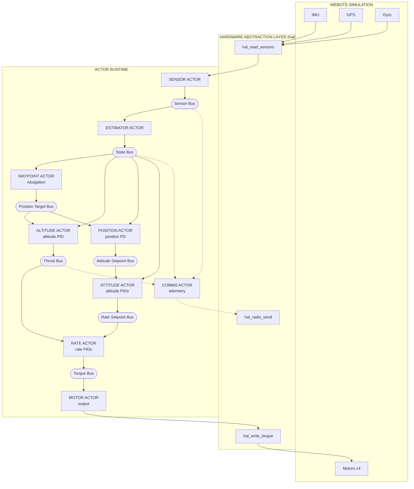
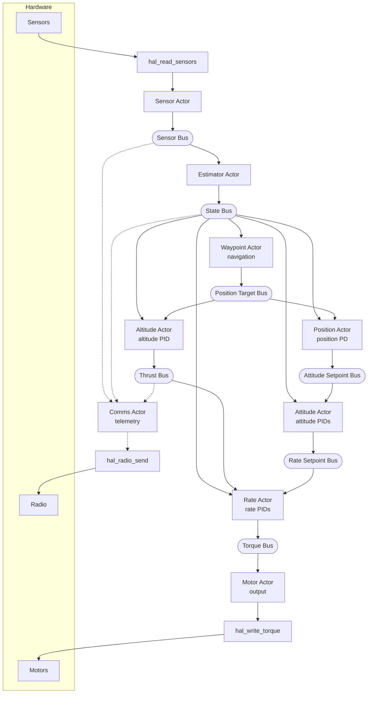
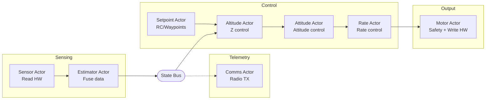

# Pilot Example Specification

A quadcopter autopilot example using the actor runtime. Supports Webots simulation
(default) and STM32 hardware (Crazyflie 2.1+).

## Status

**Implemented:**
- Altitude-hold hover with attitude stabilization
- Horizontal position hold (GPS-based XY control)
- Heading hold (yaw control with angle wrap-around)
- Waypoint navigation (square demo route with altitude and heading changes)
- Step 1: Motor actor (safety, watchdog)
- Step 2: Separate altitude actor (altitude/rate split)
- Step 3: Sensor actor (hardware abstraction)
- Step 4: Attitude actor (attitude angle control)
- Step 5: Estimator actor (sensor fusion, vertical velocity)
- Step 6: Position actor (horizontal position hold + heading hold)
- Step 7: Waypoint actor (waypoint navigation)
- Step 8: Flight manager actor (startup coordination, safety cutoff)
- Step 9: Comms actor (radio telemetry, Crazyflie only)
- Step 10: Telemetry logger actor (CSV logging, Webots only)
- Mixer moved to HAL (platform-specific, X-configuration)

## Goals

1. **Showcase the actor runtime** - demonstrate benefits of actor-based design for embedded systems
2. **Improve the runtime** - if problems arise (latency, scheduling), fix the runtime, don't work around it
3. **Beautiful code** - show how an autopilot can be elegantly written using actors
4. **Hover control** - maintain stable altitude and attitude
5. **Clean architecture** - portable actor code with HAL abstraction
6. **Webots integration** - use `hive_advance_time()` + `hive_run_until_blocked()` per simulation step

The pilot serves dual purposes: a real-world stress test that exposes runtime weaknesses, and a showcase of clean actor-based embedded design.

## Design Decisions

### Why buses instead of IPC?

- **Buses** provide latest-value semantics - subscribers get current state, not history
- **IPC notify** queues every message - slow consumers would process stale data
- For control loops, you always want the *latest* sensor reading, not a backlog

### Why max_entries=1?

All buses use `max_entries=1` (single entry, latest value only):

```c
#define HAL_BUS_CONFIG { \
    .max_subscribers = 6, \
    .max_entries = 1, \      // Latest value only
    .max_entry_size = 128 \
}
```

- Control loops need current state, not history
- If a subscriber is slow, it should skip stale data, not queue it
- Larger buffers would cause processing of outdated sensor readings
- This matches how real flight controllers handle sensor data

### Startup Ordering and Supervision

All 9 workers are spawned by the supervisor in dependency order:

1. **Sensor → Estimator** - Estimator subscribes to sensor bus
2. **Controllers** - Subscribe to state bus (created by estimator)
3. **Motor** - Subscribes to torque bus (created by rate actor)
4. **Flight manager** - Spawns last so all siblings are available

**Sibling Info:** Actors use `hive_find_sibling()` to look up sibling actor IDs
for IPC coordination. The supervisor passes sibling info at spawn time, making
the spawn order deterministic. After restart, siblings are re-resolved automatically.

**Important:** Bus subscriptions see nothing until first publish *after* subscription.
A subscriber spawned before the first publish will get valid data on first read.
A subscriber spawned *after* a publish sees nothing until the next publish.

The spawn order in `pilot.c` ensures:
1. All subscribers are ready before their data sources begin publishing
2. `flight_manager` spawns last so all siblings are available via `hive_find_sibling()`

### Supervision Semantics

**Restart strategy:** ONE_FOR_ALL - if any flight-critical actor crashes, all actors restart.

**Why ONE_FOR_ALL?** The control pipeline has tight inter-actor dependencies:
- Estimator depends on sensor data format
- Controllers depend on state estimate
- Motor depends on torque commands

If one actor crashes and restarts with fresh state while others continue with stale state,
the pipeline produces incorrect output. Restarting all actors ensures consistent state.

**State reset on restart:**
When ONE_FOR_ALL triggers, all actors restart from scratch:
- PID integrators reset to zero (no windup from previous flight)
- Kalman filter covariances reset to initial values
- Waypoint navigation resets to first waypoint
- Bus subscriptions cleared (must re-subscribe)
- IPC connections lost (must re-resolve siblings)

This is correct behavior for a flight controller - inconsistent state is more dangerous than
a brief control gap during restart.

**Comms actor isolation:**
The comms actor uses TEMPORARY restart type:
- Does NOT trigger ONE_FOR_ALL restart of flight-critical actors if it crashes
- Simply stops sending telemetry (acceptable for non-critical actor)
- Flight continues normally without comms

This isolation prevents a telemetry bug from crashing the entire flight.

**Telemetry logger isolation:**
Same as comms - TEMPORARY restart, outside the critical path.

### Pipeline Model

The control system is a pipeline, not a synchronous snapshot. Each actor processes
the most recent data available when it runs, not a coordinated snapshot from the
same instant.

**Timing characteristics (250 Hz, 4ms tick):**
- Sensor reads hardware, publishes to sensor bus
- Estimator processes sensor data, publishes state estimate
- Controllers cascade: altitude → position → attitude → rate
- Motor receives torque commands, outputs to hardware

**Worst-case latency:** One tick (4ms) from sensor read to motor output. This occurs
when sensor publishes just after motor finishes reading, requiring a full tick before
motor sees the new data.

**Why this is acceptable:**
- This pipelined approach is standard practice in flight controllers (PX4, ArduPilot)
- At 250 Hz, one tick of latency is 4ms—well within control loop requirements
- Synchronous snapshotting would add complexity with minimal benefit
- Controllers use rate damping terms that compensate for small latencies

### Error Handling Pattern

Actors use explicit error checking instead of `assert()`. This enables the supervisor
to detect and recover from failed actors.

**Cold path (initialization):** Log error and return without calling `hive_exit()`.
The supervisor sees this as a CRASH and can attempt restart per the restart strategy.

```c
if (HIVE_FAILED(hive_bus_subscribe(state->sensor_bus))) {
    HIVE_LOG_ERROR("[SENSOR] bus subscribe failed");
    return;
}
```

**Hot path - blocking calls** (`hive_select`, `hive_bus_read_wait`, `hive_ipc_recv_match`):
Log error and return. These failures indicate a fundamental runtime problem that the
actor cannot recover from.

```c
status = hive_ipc_recv_match(HIVE_SENDER_ANY, HIVE_MSG_TIMER, timer, &msg, -1);
if (HIVE_FAILED(status)) {
    HIVE_LOG_ERROR("[SENSOR] recv_match failed: %s", HIVE_ERR_STR(status));
    return;
}
```

**Hot path - non-blocking calls** (`hive_bus_publish`, `hive_ipc_notify`, `hive_timer_after`):
Log warning and continue. The actor keeps running and processes the next iteration.

```c
if (HIVE_FAILED(hive_bus_publish(state->sensor_bus, &sensors, sizeof(sensors)))) {
    HIVE_LOG_WARN("[SENSOR] bus publish failed");
}
```

**Why no `assert()`:**
- `assert()` terminates the entire process - supervisor cannot recover
- On STM32, `assert()` behavior is platform-dependent (hang, reset, undefined)
- Log + return gives consistent behavior across platforms
- Supervisor sees CRASH and applies restart strategy (ONE_FOR_ALL in pilot)

**Exception:** `_Static_assert` is used for compile-time checks (e.g., packet sizes
in comms_actor.c) since these fail at build time, not runtime.

**Logging configuration (Crazyflie):**

The Crazyflie build uses `HIVE_LOG_LEVEL=INFO`:

| Level | Status | Rationale |
|-------|--------|-----------|
| TRACE, DEBUG | Compiled out | Verbose, development only |
| INFO | Captured to flash | Important events (waypoint reached, flight started) |
| WARN, ERROR | Captured to flash | Problems that need attention |

Logs are written to flash and downloaded over radio after flight. This provides a
complete flight record for debugging without the overhead of TRACE/DEBUG messages.

## Non-Goals (Future Work)

- Full state estimation (Kalman filter)
- Failsafe handling
- Parameter tuning UI
- Multiple vehicle types

## Limitations (Production Requirements)

**This example is a demonstration, not production-ready flight software.**

A production flight controller would need error handling and failsafes that this example omits:

### Missing Error Handling

| Scenario | Current Behavior | Production Requirement |
|----------|------------------|------------------------|
| Sensor read fails | `hive_bus_read()` returns error, actor skips iteration | Watchdog timeout, switch to backup sensor or land |
| Bus publish fails | Error ignored | Log error, trigger failsafe |
| Actor crashes | Runtime notifies linked actors | Auto-restart or emergency landing |
| GPS signal lost | Position control uses stale data | Hold last position, descend slowly, or return-to-home |
| IMU data invalid | Garbage in, garbage out | Sanity checks, sensor voting, reject outliers |

### Implemented Safety Features (STM32 only)

The following safety features are enabled for real hardware (not in Webots simulation):

| Feature | Location | Behavior |
|---------|----------|----------|
| Attitude cutoff | altitude_actor.c | Motors off if roll or pitch >45° |
| Altitude cutoff | altitude_actor.c | Motors off if altitude >2m |
| Landed detection | altitude_actor.c | Motors off when target <5cm and altitude <15cm |
| Thrust ramp | altitude_actor.c | Gradual thrust increase over 0.5 seconds on takeoff |
| Startup delay | flight_manager_actor.c | Flight blocked for 60 seconds after boot |
| Hard cutoff | flight_manager_actor.c | Motors forced off 12 seconds after flight starts |

### Future Safety Features

The following may be added after initial flight testing:

- **Rate cutoff**: Motors off if angular rate exceeds threshold (e.g., >300°/s) - catches violent oscillation while within tilt limits
- **Accelerometer sanity check**: Motors off if acceleration readings are implausible
- **Sensor timeout**: Motors off if no sensor updates within expected interval

### Missing Safety Features (Production Requirements)

- **Geofence**: No boundary limits - drone can fly away indefinitely
- **Battery monitoring**: No low-voltage warning or auto-land
- **Arming/disarming**: No safety switch to prevent accidental motor start
- **Pre-flight checks**: No sensor validation before takeoff
- **Communication loss**: No failsafe if telemetry link drops

### Why These Are Omitted

This example focuses on demonstrating the actor runtime architecture, not building a safe drone. Adding proper failsafes would obscure the core concepts (actors, buses, control loops) with error handling code.

For a production system, each actor should:
1. Validate inputs before processing
2. Handle bus read/write failures
3. Implement timeouts for expected data
4. Report health status to a flight manager actor
5. Respond to emergency stop commands

### Production Instrumentation Requirements

The following instrumentation should be added for production flight software:

**Error Counters (per actor):**
- `bus_read_fail_count` - incremented when `hive_bus_read()` returns error
- `bus_publish_fail_count` - incremented when `hive_bus_publish()` returns error
- Counters exposed via telemetry or debug interface

**Motor Deadman Watchdog:** ✓ Implemented
- Motor actor uses `hive_select()` with `MOTOR_DEADMAN_TIMEOUT_MS` timeout (50ms)
- If no torque command received within timeout, all motors are zeroed
- Protects against controller actor crash leaving motors at last commanded value
- Timeout of 50ms (~12 control cycles at 250Hz) provides margin while remaining safe
- Logs warning on timeout: `[MOTOR] Deadman timeout - zeroing motors`

---

## Architecture Overview

Ten to twelve actors: nine flight-critical workers connected via buses, plus one
supervisor, and optional telemetry actors (comms on Crazyflie, telemetry_logger on Webots):

**Supervision:** All actors are supervised with ONE_FOR_ALL strategy. Flight-critical
actors use PERMANENT restart (crash triggers restart of all). Comms uses
TEMPORARY restart (crash/exit doesn't trigger restarts, just stops comms).

**Sibling Info:** Workers use `hive_find_sibling()` to look up sibling actor IDs
for IPC communication. The supervisor passes sibling info at spawn time.



### Actor Priority and Blocking Table

This table documents the scheduling design for audit and latency analysis.

| Actor | Priority | Primary Block Point | Yield Behavior |
|-------|----------|---------------------|----------------|
| sensor | CRITICAL | Timer (4ms periodic) | Yields every tick after sensor read |
| estimator | CRITICAL | Bus read (sensor_bus) | Yields waiting for sensor data |
| waypoint | CRITICAL | Bus read (state_bus) | Yields waiting for state updates |
| altitude | CRITICAL | Bus read (state_bus) | Yields waiting for state updates |
| position | CRITICAL | Bus read (state_bus) | Yields waiting for state updates |
| attitude | CRITICAL | Bus read (attitude_sp_bus) | Yields waiting for setpoints |
| rate | CRITICAL | Bus read (rate_sp_bus) | Yields waiting for setpoints |
| motor | CRITICAL | select() with 50ms timeout | Yields waiting for torque or timeout |
| flight_manager | CRITICAL | Timer + IPC recv | Yields on coordination events |
| comms | LOW | Bus read (multiple) | Non-critical, may be starved |
| telemetry_logger | LOW | Bus read + timer | Non-critical, may be starved |

**Scheduling characteristics:**
- All flight-critical actors run at CRITICAL priority
- Each actor blocks on its upstream bus, creating natural pipeline synchronization
- No actor performs unbounded computation between yields
- LOW priority actors (comms, telemetry) may experience latency under load but do not affect flight safety
- Motor actor's 50ms deadman timeout ensures it yields regularly even if upstream fails

---

## Implementation Details

### Multi-File Design

Code is split into focused modules:

| File | Purpose |
|------|---------|
| `pilot.c` | Main loop, bus setup, actor spawn |
| `sensor_actor.c/h` | Reads sensors via HAL, publishes to sensor bus |
| `estimator_actor.c/h` | Sensor fusion → state bus |
| `altitude_actor.c/h` | Altitude PID → thrust |
| `waypoint_actor.c/h` | Waypoint navigation → position target bus |
| `position_actor.c/h` | Position PD → attitude setpoints |
| `attitude_actor.c/h` | Attitude PIDs → rate setpoints |
| `rate_actor.c/h` | Rate PIDs → torque commands |
| `motor_actor.c/h` | Output: torque → HAL → motors |
| `flight_manager_actor.c/h` | Startup delay, flight window cutoff |
| `comms_actor.c/h` | Radio telemetry (Crazyflie only) |
| `telemetry_logger_actor.c/h` | CSV logging for PID tuning (Webots only) |
| `pid.c/h` | Reusable PID controller |
| `types.h` | Portable data types |
| `config.h` | Configuration constants (timing, thresholds) |
| `math_utils.h` | Math macros (CLAMPF, LPF, NORMALIZE_ANGLE) |
| `notifications.h` | IPC notification tags (NOTIFY_FLIGHT_START, etc.) |
| `flight_profiles.h` | Waypoint definitions per flight profile |
| `tools/*.py` | PID tuning and telemetry analysis tools |

### Data Flow



---

## Control Algorithms

### PID Controller

Standard discrete PID with anti-windup:

```c
float pid_update(pid_state_t *pid, float setpoint, float measurement, float dt) {
    float error = setpoint - measurement;

    float p = pid->kp * error;

    pid->integral += error * dt;
    pid->integral = clamp(pid->integral, -integral_max, integral_max);
    float i = pid->ki * pid->integral;

    float d = pid->kd * (error - pid->prev_error) / dt;
    pid->prev_error = error;

    return clamp(p + i + d, -output_max, output_max);
}
```

### Tuned PID Gains

PID gains are platform-specific, defined in each `hal/<platform>/hal_config.h`.
The control cascade uses:

- **Altitude:** PI + velocity damping (Kv) for smooth response
- **Position:** PD with velocity damping, max tilt limited
- **Attitude:** P controller for roll/pitch/yaw angles
- **Rate:** PD controller for angular rates

### Mixer

Each HAL implements its own X-configuration mixer in `hal_write_torque()`.
See `hal/<platform>/README.md` for motor layout and mixing equations.

---

## Main Loop

The main loop is minimal - all logic lives in actors:

```c
// Simulation (Webots)
while (hal_step()) {
    hive_advance_time(HAL_TIME_STEP_US);
    hive_run_until_blocked();
}

// Real-time (STM32)
hive_run();
```

Control rate is 250 Hz (4ms time step). Each step triggers the control chain:
sensor → estimator → altitude/waypoint/position → attitude → rate → motor.

---

## Portability

### Hardware Abstraction Layer (HAL)

All hardware access goes through `hal/hal.h`. Each platform provides its own
implementation of this interface:

```c
// Platform lifecycle
int hal_init(void);        // Initialize hardware
void hal_cleanup(void);    // Release resources
bool hal_self_test(void);  // Verify sensors respond (returns true if OK)
void hal_calibrate(void);  // Calibrate sensors
void hal_arm(void);        // Enable motor output
void hal_disarm(void);     // Disable motor output

// Sensor interface (called by sensor_actor)
void hal_read_sensors(sensor_data_t *sensors);

// Motor interface (called by motor_actor)
void hal_write_torque(const torque_cmd_t *cmd);

// Radio interface (called by comms_actor, HAL_HAS_RADIO only)
int hal_radio_init(void);
int hal_radio_send(const void *data, size_t len);
bool hal_radio_tx_ready(void);
void hal_radio_poll(void);

// Simulation time (only for SIMULATED_TIME builds)
bool hal_step(void);  // Advance simulation, returns false when done
```

Actors use the HAL directly - no function pointers needed:
- `sensor_actor.c` calls `hal_read_sensors()`
- `motor_actor.c` calls `hal_write_torque()`
- `comms_actor.c` calls `hal_radio_*()` (Crazyflie only)

### Startup Sequence

The HAL startup sequence in `pilot.c` is:

```c
hal_init();       // Initialize hardware
hal_self_test();  // Verify sensors respond
hal_calibrate();  // Calibrate sensors (keep drone still and level)
hal_arm();        // Enable motor output
```

If any step fails, the program aborts before starting the actor runtime.

### LED Feedback (Hardware Platforms)

Real hardware platforms (Crazyflie) provide LED feedback during startup:

| Pattern | Stage | Meaning |
|---------|-------|---------|
| 1-3 slow blinks | init | Progress indicator (1=start, 2=IMU OK, 3=all OK) |
| 3-5 fast blinks | init | Hardware init failed (count indicates component) |
| 6-9 fast blinks | self-test | Sensor self-test failed (count indicates sensor) |
| 10 fast blinks | calibrate | Level warning (drone tilted >6°) |
| Slow blink | calibrate | Calibration in progress |
| LED off | calibrate | Calibration complete |
| LED on | armed | Ready to fly |
| Slow continuous blink | any | Fatal error (stuck in loop) |

See `hal/<platform>/README.md` for detailed LED patterns per platform.

### Supported Platforms

| Platform | Build | Details |
|----------|-------|---------|
| Webots simulation | `make` | Uses `-DSIMULATED_TIME` |
| Crazyflie 2.1+ | `make -f Makefile.crazyflie-2.1+` | See `hal/crazyflie-2.1+/README.md` |

All hardware differences are encapsulated in the HAL. Actor code is identical
across platforms. The only compile-time difference is `SIMULATED_TIME` which
controls the main loop (simulation vs real-time).

### Portable Code

All actor code is platform-independent. Actors use:
- Bus API for inter-actor communication
- HAL API for hardware access (abstracted)

| File | Dependencies |
|------|--------------|
| `sensor_actor.c/h` | HAL (hal_read_sensors) + bus API |
| `estimator_actor.c/h` | Bus API only |
| `altitude_actor.c/h` | Bus API only |
| `waypoint_actor.c/h` | IPC + bus API |
| `position_actor.c/h` | Bus API only |
| `attitude_actor.c/h` | Bus API only |
| `rate_actor.c/h` | Bus API only |
| `motor_actor.c/h` | HAL (hal_write_torque) + IPC + bus API |
| `flight_manager_actor.c/h` | IPC only (no bus) |
| `comms_actor.c/h` | HAL (hal_radio_*) + bus API (Crazyflie only) |
| `pid.c/h` | Pure C, no runtime deps |
| `types.h` | Data structures |
| `config.h` | Tuning parameters |

---

## File Structure

```
examples/pilot/
    pilot.c              # Main loop, bus setup, supervisor config
    sensor_actor.c       # Reads sensors via HAL → sensor bus
    estimator_actor.c    # Sensor fusion → state bus
    altitude_actor.c     # Altitude PID → thrust
    waypoint_actor.c     # Waypoint navigation → position target bus
    position_actor.c     # Position PD → attitude setpoints
    attitude_actor.c     # Attitude PIDs → rate setpoints
    rate_actor.c         # Rate PIDs → torque commands
    motor_actor.c        # Output: torque → HAL → motors
    flight_manager_actor.c # Startup delay, flight window cutoff
    comms_actor.c        # Radio telemetry (Crazyflie only)
    telemetry_logger_actor.c # CSV logging (Webots only)
    pid.c                # Reusable PID controller
    stack_profile.c      # Stack usage profiling
    include/             # Header files
        *_actor.h        # Actor interfaces
        types.h          # Portable data types
        config.h         # Configuration constants
        math_utils.h     # Math macros
        notifications.h  # IPC notification tags
        flight_profiles.h # Waypoint definitions
        pid.h            # PID controller interface
        pilot_buses.h    # Bus handle struct
    fusion/
        complementary_filter.c/h  # Portable attitude estimation
    tools/
        analyze_pid.py       # PID metrics analysis (overshoot, settling time)
        plot_telemetry.py    # 6-panel telemetry visualization
        plot_flight.py       # Full flight summary with 3D trajectory
        ground_station.py    # Radio telemetry receiver (Crazyflie)
        README.md            # Tools documentation
    Makefile                 # Webots simulation build
    Makefile.crazyflie-2.1+  # Crazyflie 2.1+ build
    hive_config.mk           # Shared Hive memory config
    SPEC.md              # This specification
    README.md            # Usage instructions
    FIRST_FLIGHT_CHECKLIST.md  # Hardware bring-up and flight checklist
    worlds/
        hover_test.wbt   # Webots world file
    controllers/
        pilot/           # Webots controller (installed here)
    hal/
        hal.h                # Common HAL interface
        webots-crazyflie/    # Webots simulation HAL
        crazyflie-2.1+/      # Crazyflie 2.1+ HAL (STM32F405)
            bringup/         # Hardware bring-up test firmware
            tests/           # HAL test firmware
```

---

## Testing Results

### Hover Behavior

1. Drone starts at 0.5m altitude (world file setting)
2. Altitude PID commands increased thrust
3. Drone rises with some initial oscillation
4. Settles at 1.0m within ~3 seconds
5. Maintains stable hover at 1.0m ± 0.05m

### Console Output

```
10 actors spawned (9 children + 1 supervisor)
[ALT] tgt=1.00 alt=0.01 vvel=0.00 thrust=0.750
[ALT] tgt=1.00 alt=0.05 vvel=0.12 thrust=0.720
...
[WPT] Advancing to waypoint 1: (1.0, 0.0, 1.2) yaw=0 deg
[ALT] tgt=1.20 alt=1.02 vvel=0.05 thrust=0.560
[POS] tgt=(1.0,0.0) x=0.12 y=0.00 pitch=5.2 roll=0.0
...
```

---

## Architecture Evolution Roadmap

The example will evolve incrementally toward a clean multi-actor design.
Each step maintains a working system while improving separation of concerns.

### Target Architecture



### Actor Responsibilities (Current)

| Actor | Input | Output | Priority | Restart | Responsibility |
|-------|-------|--------|----------|---------|----------------|
| **Supervisor** | Child exit notifications | (internal) | CRITICAL | - | Monitors workers, ONE_FOR_ALL restart |
| **Sensor** | Hardware | Sensor Bus | CRITICAL | PERMANENT | Read raw sensors, publish |
| **Estimator** | Sensor Bus | State Bus | CRITICAL | PERMANENT | Complementary filter fusion, state estimate |
| **Waypoint** | State Bus + START notification | Position Target Bus | CRITICAL | PERMANENT | Waypoint navigation (3D on Webots, altitude-only on STM32) |
| **Altitude** | State + Position Target Bus + LANDING | Thrust Bus + LANDED | CRITICAL | PERMANENT | Altitude PID (250Hz), landing detection |
| **Position** | Position Target + State Bus | Attitude Setpoint Bus | CRITICAL | PERMANENT | Position PD (250Hz) |
| **Attitude** | Attitude Setpoint + State | Rate Setpoint Bus | CRITICAL | PERMANENT | Attitude PIDs (250Hz) |
| **Rate** | State + Thrust + Rate SP | Torque Bus | CRITICAL | PERMANENT | Rate PIDs (250Hz) |
| **Motor** | Torque Bus + STOP notification | Hardware | CRITICAL | PERMANENT | Output to hardware via HAL |
| **Flight Manager** | LANDED notification | START/LANDING/STOP notifications | CRITICAL | TRANSIENT | Startup delay, landing coordination (normal exit = mission complete) |
| **Comms** | Sensor + State + Thrust Bus | Radio (HAL) | LOW | TEMPORARY | Radio telemetry (Crazyflie only, not flight-critical) |
| **Telemetry Logger** | Sensor + State + Thrust + Position Target Bus | CSV file | LOW | TEMPORARY | CSV logging for PID tuning (Webots only, not flight-critical) |

**Why CRITICAL for flight actors?** Flight-critical actors share the same priority so execution
order follows spawn order (round-robin within priority level). This ensures the data pipeline
executes correctly: sensor → estimator → waypoint → altitude → position → attitude → rate →
motor → flight_manager. Differentiated priorities would break this—higher priority actors run
first regardless of spawn order, causing motor to output before controllers have computed new
values. Telemetry runs at LOW priority since it's not flight-critical and shouldn't delay
control loops.

### Step 1: Motor Actor ✓

Separate motor output into dedicated actor.

```
Rate Actor ──► Torque Bus ──► Motor Actor ──► HAL ──► Hardware
                               (output)         (mixer)
```

**Features:** Subscribe to torque bus, call HAL for motor output. Mixer is in HAL.

### Step 2: Separate Altitude Actor ✓

Split altitude control from rate control.

```
Sensor Bus ──► Altitude Actor ──► Thrust Bus ──► Rate Actor ──► Torque Bus
            (altitude PID)                    (rate PIDs only)
```

**Benefits:** Clear separation, different rates possible, easier tuning.

### Step 3: Sensor Actor ✓

Move sensor reading from main loop into actor.

```
Main Loop: hal_step() + hive_advance_time() + hive_run_until_blocked()
Sensor Actor: timer ──► hal_read_sensors() ──► Sensor Bus
```

**Benefits:** Main loop is minimal, all logic in timer-driven actors.

### Step 4: Attitude Actor ✓

Add attitude angle control between altitude and rate control.

**Before:**
```
Sensor Bus ──► Rate Actor (rate PIDs with hardcoded 0.0 setpoints)
```

**After:**
```
Sensor Bus ──► Attitude Actor ──► Rate Setpoint Bus ──► Rate Actor
            (attitude PIDs)                          (rate PIDs)
```

**Benefits:**
- Cascaded control (proper drone architecture)
- Attitude controller generates rate setpoints
- Rate controller tracks those setpoints
- Easier to tune each layer independently

### Step 5: Estimator Actor ✓

Add sensor fusion between raw sensors and controllers.

**Before:**
```
Sensor Actor ──► Sensor Bus ──► Controllers
```

**After:**
```
Sensor Actor ──► Sensor Bus ──► Estimator Actor ──► State Bus ──► Controllers
                             (complementary filter)
```

**Implementation:**
- Runs portable complementary filter (`fusion/complementary_filter.c`)
- Fuses accelerometer and gyroscope for roll/pitch estimation
- Fuses magnetometer for yaw (when available)
- Computes velocities by differentiating position with low-pass filter
- Webots: synthesizes accelerometer from gravity + inertial_unit angles

**Benefits:**
- Controllers use state estimate, not raw sensors
- Derived values (velocities) computed in one place
- Fusion algorithm is portable (same code on all platforms)
- HALs are simpler (just raw sensor reads)

### Step 6: Position Actor ✓

Add horizontal position hold and heading hold.

**Before:**
```
Attitude Actor uses hardcoded 0.0 attitude setpoints
```

**After:**
```
State Bus ──► Position Actor ──► Attitude Setpoint Bus ──► Attitude Actor
              (position PD)       (roll, pitch, yaw)    (attitude PIDs)
```

**Implementation:**
- Simple PD controller: position error → attitude command
- Velocity damping: reduces overshoot
- Max tilt limit: 0.35 rad (~20°) for safety
- Sign conventions match Bitcraze Webots controller
- Heading hold: publishes target yaw from waypoint actor
- Angle wrap-around: `pid_update_angle()` handles ±π discontinuity
- World-to-body frame transformation based on current yaw

**Benefits:**
- Drone holds XY position and heading
- Returns to target when displaced or rotated
- Takes shortest rotation path (never rotates >180°)

### Step 7: Waypoint Actor ✓

Add waypoint navigation with platform-specific routes.

**Before:**
```
Altitude Actor uses hardcoded TARGET_ALTITUDE
Position Actor uses hardcoded TARGET_X, TARGET_Y, TARGET_YAW
```

**After:**
```
                              ┌──► Altitude Actor (reads z)
State Bus ──► Waypoint Actor ──► Position Target Bus
              (navigation)       (x, y, z, yaw)
                              └──► Position Actor (reads x, y, yaw)
```

**Implementation:**
- Manages list of waypoints (platform-specific)
- Publishes current target to position target bus
- Altitude actor reads target altitude from position target bus
- Position actor reads target XY and yaw from position target bus
- Monitors state bus for arrival detection
- Arrival requires: altitude, heading within tolerance, velocity below threshold
- Hovers briefly at each waypoint before advancing
- Loops forever: returns to first waypoint after completing route

**Platform-specific routes:**
- **Webots:** 3D waypoints with square pattern and altitude changes
- **STM32 hardware:** Platform-dependent (see flight profiles in README.md)
- **First flight test:** Hover at 0.5m briefly, then land (safe tethered test)

**Benefits:**
- Decouples waypoint logic from both position and altitude control
- Both actors read targets from bus (no hardcoded values)
- World-to-body frame transformation handles arbitrary headings
- Easy to extend with mission planning

### Step 8: Flight Manager Actor ✓

Add centralized startup coordination and safety cutoff.

**Before:**
```
Startup delay and flight window in motor_actor
Waypoint actor starts immediately
```

**After:**
```
Flight Manager ──► START ──► Waypoint Actor
                              │
                              ↓ (flight begins)
               ──► LANDING ──► Altitude Actor
                              │
               ◄── LANDED ◄───┘ (touchdown detected)
                              │
               ──► STOP ────► Motor Actor
                              │
                              ↓ (motors zeroed)
```

**Implementation:**
- Handles 60-second startup delay (hardware only)
- Opens log file (erases flash sector on STM32)
- Sends START notification to waypoint actor to begin flight
- Periodic log sync every 4 seconds
- Flight duration per profile (10s/40s/60s)
- Sends LANDING notification to altitude actor
- Waits for LANDED notification (touchdown detected)
- Sends STOP notification to motor actor
- Closes log file

**Benefits:**
- Centralized safety timing (not scattered across actors)
- Clear flight authorization flow
- Waypoint actor blocks until flight manager authorizes flight
- Easy to add pre-flight checks in one place

### Step 9: Comms Actor ✓

Add radio telemetry for ground station logging (Crazyflie only).

**Before:**
```
No real-time flight data logging during flight
```

**After:**
```
State Bus ──┬──► Comms Actor ──► HAL Radio ──► Crazyradio 2.0 ──► Ground Station
Sensor Bus ─┤      (100Hz)
Thrust Bus ─┘
```

**Implementation:**
- Subscribes to sensor, state, and thrust buses (not position target bus)
- Position targets omitted due to 31-byte ESB packet size limit
- Sends binary packets at 100Hz over syslink protocol
- Two operating modes:
  - Flight mode: Sends telemetry packets at 100Hz
  - Download mode: Transfers flash log file to ground station on request
- Telemetry packet types (31-byte ESB limit):
  - Type 0x01: Attitude/rates (gyro XYZ, roll/pitch/yaw)
  - Type 0x02: Position (altitude, velocities, thrust)
- Log download packet types:
  - Type 0x10: CMD_REQUEST_LOG (ground -> drone)
  - Type 0x11: LOG_CHUNK (drone -> ground, 28 bytes data)
  - Type 0x12: LOG_COMPLETE (drone -> ground)
- Runs at LOW priority so control loops run first each cycle
- Radio send blocks ~370us (37 bytes * 10 bits/byte / 1Mbaud)
- Uses TEMPORARY restart (crash/exit doesn't trigger restarts of flight-critical actors)

**Ground station commands (from examples/pilot directory):**
```bash
pip install cflib
./tools/ground_station.py -o flight.csv        # Receive telemetry
./tools/ground_station.py --download-log log.bin  # Download log file
../../tools/decode_log.py log.bin > log.txt    # Decode binary log
```

**Benefits:**
- Real-time flight data for debugging and analysis
- Post-flight log download (no physical access required)
- Separate from flash logging (higher rate, no flash wear)
- Non-intrusive (LOW priority doesn't affect control loops)

### Step 10: Telemetry Logger Actor ✓

Add CSV logging for PID tuning and flight analysis (Webots only).

**Before:**
```
No structured data export for analysis
```

**After:**
```
State Bus ──┬──► Telemetry Logger ──► /tmp/pilot_telemetry.csv
Sensor Bus ─┤      (25Hz)
Thrust Bus ─┤
Position Target Bus ─┘
```

**Implementation:**
- Subscribes to sensor, state, thrust, and position target buses
- Writes CSV at 25Hz with all flight data
- Enabled by default for Webots (`SIMULATED_TIME`), disabled for Crazyflie
- Log path passed via `telemetry_logger_config` struct at spawn time
- Runs at LOW priority, TEMPORARY restart (not flight-critical)
- Flushes to disk every second (25 samples)

**CSV columns:**
- `time_ms`: Timestamp since flight start
- `roll,pitch,yaw`: Attitude angles (rad)
- `roll_rate,pitch_rate,yaw_rate`: Angular rates (rad/s)
- `x,y,altitude`: Position (m)
- `vx,vy,vz`: Velocities (m/s)
- `thrust`: Thrust command (normalized)
- `target_x,target_y,target_z,target_yaw`: Position targets
- `gyro_x,gyro_y,gyro_z`: Raw gyro (rad/s)
- `accel_x,accel_y,accel_z`: Raw accel (m/s²)

**Usage:**
```bash
# Run simulation (make now auto-installs to Webots)
make
webots worlds/hover_test.wbt

# Analyze PID performance
python3 tools/analyze_pid.py /tmp/pilot_telemetry.csv

# Visualize telemetry (6-panel plot)
python3 tools/plot_telemetry.py /tmp/pilot_telemetry.csv

# Full flight summary with 3D trajectory
python3 tools/plot_flight.py /tmp/pilot_telemetry.csv
```

**Benefits:**
- Data-driven PID tuning (vs blind iteration)
- Visualize oscillations, overshoot, settling time
- Quantitative metrics: rise time, settling time, RMS error
- Compare before/after gain changes
- Non-intrusive (LOW priority doesn't affect control loops)

### Step 11 (Future): RC Input / Mode Switching

**Future extensions:**
- RC input handling (manual override)
- Takeoff/landing sequences
- Mode switching (hover, land, follow-me, etc.)
- Dynamic waypoint updates via telemetry

---

## Memory Requirements

### STM32 Builds

| Platform | Flash | RAM | MCU |
|----------|-------|-----|-----|
| Crazyflie 2.1+ | ~63 KB | ~120 KB | STM32F405 (1 MB / 192 KB) |

### Configuration Split

Hive memory settings are split between shared and platform-specific files:

| File | Contents |
|------|----------|
| `hive_config.mk` | Shared settings: actors, buses, pools, message size, supervisor limits |
| `Makefile.<platform>` | Platform-specific: stack sizes, flash layout |

The shared settings in `hive_config.mk` are determined by the pilot application
(10-11 actors, 7 buses, pool sizes for supervision) and are identical across all
platforms. Only stack sizes vary based on available RAM.

Key memory optimizations in `hive_config.mk`:
- Supervisor pool reduced to 1 supervisor with 12 children (saves ~23 KB vs default)
- Pool sizes tuned for pilot's actual usage patterns

### Measured Stack Usage

Build with `STACK_PROFILE=1` to measure actual stack usage via watermarking.
Results from x86-64 Linux (Webots simulation) with 4KB stacks:

| Actor | Used | Usage | Notes |
|-------|------|-------|-------|
| waypoint | 3232 | 78.9% | Highest - waypoint list + arrival detection |
| flight_mgr | 3112 | 76.0% | Log file management + IPC |
| altitude | 2664 | 65.0% | PID state + landing logic |
| supervisor | 2504 | 61.1% | Child management overhead |
| sensor | 2008 | 49.0% | HAL sensor structs |
| estimator | 808 | 19.7% | Complementary filter state |
| rate | 792 | 19.3% | Rate PIDs |
| attitude | 760 | 18.6% | Attitude PIDs |
| position | 680 | 16.6% | Position PD |
| motor | 488 | 11.9% | Lowest - simple output |

All actors fit comfortably in 4KB with ~860 bytes headroom (78.9% peak).
ARM Cortex-M may differ slightly due to calling conventions.

---

## Future Extensions

1. **Mission planning** - Load waypoints from file, complex routes
2. **Sensor fusion** - ✓ Complementary filter implemented (estimator actor)
3. **Failsafe** - Motor failure detection, emergency landing
4. **Telemetry** - ✓ Radio telemetry implemented (Crazyflie only)
5. **RC input** - Manual control override
6. **Setpoint actor** - Altitude command generation, mode switching
7. **Bus retention on subscribe** - Late subscribers immediately receive most recent value (useful after supervisor restart). Current behavior: wait for next publish cycle, acceptable for high-frequency buses (< 4ms delay at 250Hz)
