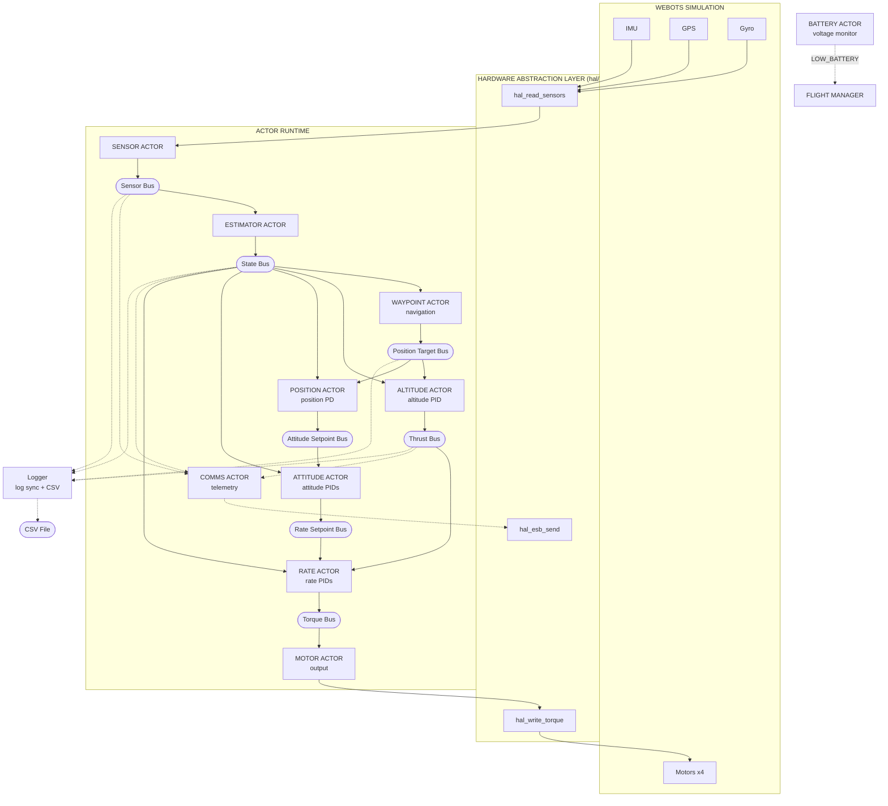

# Design

Goals, design decisions, and architecture overview for the pilot autopilot.

## Table of Contents

- [Status](#status)
- [Goals](#goals)
- [Why Actors Instead of Tasks?](#why-actors-instead-of-tasks)
- [Design Decisions](#design-decisions)
- [Architecture Overview](#architecture-overview)

---

## Status

12-13 actors implemented (see [Actor Counts](README.md#actor-counts)):
cascaded PID control, sensor fusion (3 filters), waypoint navigation,
supervised restart, radio telemetry, battery monitoring, CSV logging.

## Goals

1. **Showcase the actor runtime** - demonstrate benefits of actor-based design for embedded systems
2. **Improve the runtime** - if problems arise (latency, scheduling), fix the runtime, don't work around it
3. **Beautiful code** - show how an autopilot can be elegantly written using actors
4. **Hover control** - maintain stable altitude and attitude
5. **Clean architecture** - portable actor code with HAL abstraction
6. **Webots integration** - use `hive_advance_time()` + `hive_run_until_blocked()` per simulation step

The pilot serves dual purposes: a real-world stress test that exposes runtime weaknesses, and a showcase of clean actor-based embedded design.

## Why Actors Instead of Tasks?

Traditional RTOS designs use tasks with shared memory and locks. Actors use message passing with no shared state. Why choose actors for a flight controller?

**Isolation** - Each actor has private state. A bug in the altitude controller cannot corrupt the rate controller's PID state. With shared memory, a wild pointer in one task can silently corrupt another.

**Explicit dependencies** - Data flows through buses and IPC. You can trace exactly which actor produces data and which consumes it. With shared memory, dependencies hide in global variables and lock ordering.

**Supervision** - When an actor crashes, the supervisor restarts it with clean state. With tasks, a crash typically means system reset. Actors let you recover from software faults without losing the aircraft.

**Testing** - Actors with message-passing interfaces are easy to test in isolation. Inject messages, observe outputs. Shared-memory tasks require complex test harnesses to set up global state.

**The cost** - Message copying instead of pointer sharing. For a 250Hz control loop with small messages (< 100 bytes), this overhead is negligible compared to the safety benefits.

## Design Decisions

### Why buses instead of IPC?

Buses provide latest-value semantics - subscribers get current state, not
history. IPC notify queues every message, so slow consumers would process
stale data. For control loops, you always want the *latest* sensor reading.

All buses use `max_entries=1, max_subscribers=8, max_entry_size=128`
(see `HAL_BUS_CONFIG` in `config.h`). Subscriptions do not receive retained
values; subscribers only see publishes that occur after subscription.

### Startup Ordering and Supervision

All flight-critical workers are spawned by the supervisor in dependency order (see [Actor Counts](README.md#actor-counts)):

1. **Sensor -> Estimator** - Estimator subscribes to sensor bus
2. **Controllers** - Subscribe to state bus (created by estimator)
3. **Motor** - Subscribes to torque bus (created by rate actor)
4. **Flight manager** - Spawns last so all siblings are available

**Sibling Info** - Actors use `hive_find_sibling()` to look up sibling actor IDs
for IPC coordination. The supervisor passes sibling info at spawn time, making
the spawn order deterministic. After restart, siblings are re-resolved automatically.

**Important** - Bus subscriptions see nothing until first publish *after* subscription.
A subscriber spawned before the first publish will get valid data on first read.
A subscriber spawned *after* a publish sees nothing until the next publish.

The spawn order in `pilot.c` ensures:
1. All subscribers are ready before their data sources begin publishing
2. `flight_manager` spawns last so all siblings are available via `hive_find_sibling()`

### Supervision Semantics

**Restart strategy** - ONE_FOR_ALL - if any flight-critical actor crashes, all actors restart.

**Why ONE_FOR_ALL?** The control pipeline has tight inter-actor dependencies:
- Estimator depends on sensor data format
- Controllers depend on state estimate
- Motor depends on torque commands

If one actor crashes and restarts with fresh state while others continue with stale state,
the pipeline produces incorrect output. Restarting all actors ensures consistent state.

**State reset on restart**
When ONE_FOR_ALL triggers, all actors restart from scratch:
- PID integrators reset to zero (no windup from previous flight)
- Kalman filter covariances reset to initial values
- Waypoint navigation resets to first waypoint
- Bus subscriptions cleared (must re-subscribe)
- IPC connections lost (must re-resolve siblings)

This is correct behavior for a flight controller - inconsistent state is more dangerous than
a brief control gap during restart.

**Non-critical actor isolation** - Comms, battery, and logger use TEMPORARY
restart at LOW priority. If any crashes, flight continues without it. A
telemetry or logging bug cannot trigger ONE_FOR_ALL restart of the control
pipeline.

### Pipeline Model

The control system is a pipeline, not a synchronous snapshot. Each actor processes
the most recent data available when it runs, not a coordinated snapshot from the
same instant.

**Timing characteristics (250 Hz, 4ms tick)**
- Sensor reads hardware, publishes to sensor bus
- Estimator processes sensor data, publishes state estimate
- Controllers cascade: altitude -> position -> attitude -> rate
- Motor receives torque commands, outputs to hardware

**Typical latency** - Under nominal conditions, pipeline latency is within one tick (~4ms) from sensor read to motor output. Worst-case latency is bounded by the control period plus any additional delay from missed publishes, timeouts, or supervisor restarts.

**Why this is acceptable**
- This pipelined approach is standard practice in flight controllers (PX4, ArduPilot)
- At 250 Hz, typical latency of 4ms is well within control loop requirements
- Synchronous snapshotting would add complexity with minimal benefit
- Controllers use rate damping terms that compensate for small latencies

### Error Handling Pattern

No `assert()` - it kills the process and the supervisor cannot recover.
Instead, actors use `HIVE_FAILED()` checks with two patterns:

| Path | Action | Example |
|------|--------|---------|
| Init / blocking calls | Log ERROR, `hive_exit(CRASH)` | Bus subscribe, timer_recv, hive_select |
| Non-blocking calls | Log WARN, continue | Bus publish, IPC notify |

The supervisor sees CRASH exits and applies ONE_FOR_ALL restart.

## Architecture Overview

12-13 actors depending on platform (see [Actor Counts](README.md#actor-counts)).
See [Supervision Semantics](#supervision-semantics) above for restart strategy.

### Actor Priority and Blocking Table

This table documents the scheduling design for audit and latency analysis.

| Actor | Priority | Primary Block Point | Yield Behavior |
|-------|----------|---------------------|----------------|
| sensor | CRITICAL | Timer (4ms periodic) | Yields every tick after sensor read |
| estimator | CRITICAL | Bus read (1 bus) | Yields waiting for sensor data |
| waypoint | CRITICAL | hive_select (1 bus + timer) | Yields waiting for state or hover timer |
| altitude | CRITICAL | hive_select (1 bus + IPC) | Yields waiting for state or LANDING |
| position | CRITICAL | Bus read (2 buses) | Yields waiting for state + position target |
| attitude | CRITICAL | Bus read (2 buses) | Yields waiting for state + attitude setpoint |
| rate | CRITICAL | Bus read (3 buses) | Yields waiting for state + thrust + rate setpoint |
| motor | CRITICAL | hive_select (1 bus + IPC, 50ms timeout) | Yields waiting for torque, STOP, or timeout |
| flight_manager | CRITICAL | hive_select (2 timers) | Yields waiting for sync or flight timer |
| battery | LOW | hive_select (timer + IPC) | Yields waiting for sample timer or RESET |
| comms | LOW | HAL event (RX) + bus read (3 buses) | Non-critical, event-driven RX |
| logger | LOW | Timer + bus read (4 buses) | Non-critical, may be starved |

**Scheduling characteristics**
- All flight-critical actors run at CRITICAL priority
- Each actor blocks on its upstream bus, creating natural pipeline synchronization
- No actor performs unbounded computation between yields
- LOW priority actors (comms, telemetry) may experience latency under load but do not affect flight safety
- Motor actor's 50ms deadman timeout ensures it yields regularly even if upstream fails

### Actor Responsibilities

| Actor | Input | Output | Priority | Restart | Responsibility |
|-------|-------|--------|----------|---------|----------------|
| **Supervisor** | Child exit notifications | (internal) | CRITICAL | - | Monitors workers, ONE_FOR_ALL restart |
| **Sensor** | Hardware | Sensor Bus | CRITICAL | PERMANENT | Read raw sensors, publish |
| **Estimator** | Sensor Bus | State Bus | CRITICAL | PERMANENT | Complementary filter (attitude) + altitude KF + horizontal KF |
| **Waypoint** | State Bus + START notification | Position Target Bus | CRITICAL | PERMANENT | Waypoint navigation (3D on Webots, altitude-only on STM32) |
| **Altitude** | State + Position Target Bus + LANDING | Thrust Bus + LANDED | CRITICAL | PERMANENT | Altitude PID, landing detection |
| **Position** | Position Target + State Bus | Attitude Setpoint Bus | CRITICAL | PERMANENT | Position PD |
| **Attitude** | Attitude Setpoint + State | Rate Setpoint Bus | CRITICAL | PERMANENT | Attitude PIDs |
| **Rate** | State + Thrust + Rate SP | Torque Bus | CRITICAL | PERMANENT | Rate PIDs |
| **Motor** | Torque Bus + STOP notification | Hardware | CRITICAL | PERMANENT | Output to hardware via HAL |
| **Flight Manager** | LANDED + LIFTOFF + LOW_BATTERY notifications | START/LANDING/STOP notifications, RESET request/reply | CRITICAL | PERMANENT | Flight state machine, loops for multiple flights |
| **Battery** | Timer (2 Hz) + RESET notification | LOW_BATTERY notification | LOW | TEMPORARY | Voltage monitoring, debounced emergency landing (not flight-critical) |
| **Comms** | Sensor + State + Thrust Bus + HAL event | Radio (HAL) | LOW | TEMPORARY | Radio telemetry (Crazyflie only, event-driven RX, not flight-critical) |
| **Logger** | Sensor + State + Thrust + Position Target Bus | CSV file | LOW | TEMPORARY | Hive log sync + CSV telemetry (to /sd or /tmp, not flight-critical) |

**Why CRITICAL for flight actors?** Flight-critical actors share the same priority so execution
order follows spawn order (round-robin within priority level). This ensures the data pipeline
executes correctly: sensor -> estimator -> waypoint -> altitude -> position -> attitude -> rate ->
motor -> flight_manager. Differentiated priorities would break this; higher priority actors run
first regardless of spawn order, causing motor to output before controllers have computed new
values. Telemetry runs at LOW priority since it's not flight-critical and shouldn't delay
control loops.

> **Runtime assumption** - This design relies on deterministic round-robin scheduling within a priority level, as guaranteed by the Hive runtime. Changing actor priorities requires re-validating pipeline execution order.
