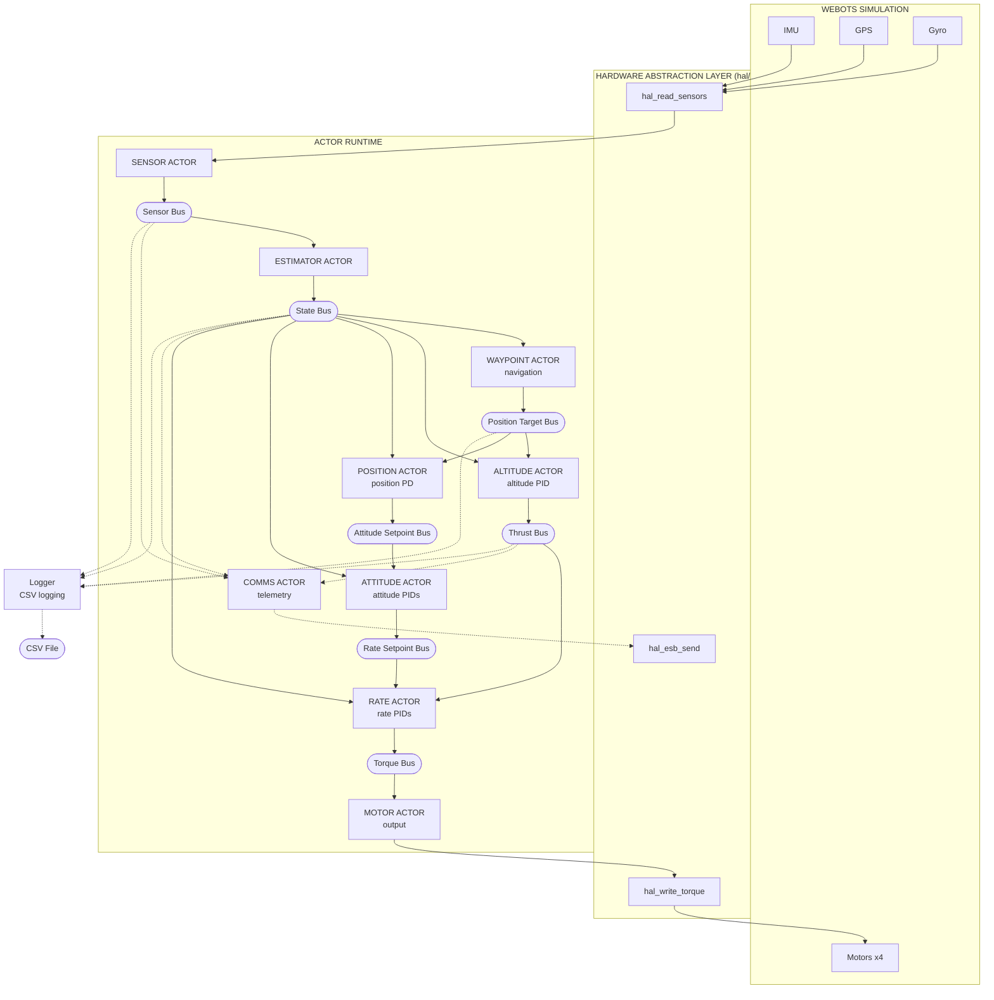

# Design

Goals, design decisions, and architecture overview for the pilot autopilot.

## Table of Contents

- [Status](#status)
- [Goals](#goals)
- [Why Actors Instead of Tasks?](#why-actors-instead-of-tasks)
- [Design Decisions](#design-decisions)
- [Architecture Overview](#architecture-overview)

---

## Status

**Implemented**
- Altitude-hold hover with attitude stabilization
- Horizontal position hold (simulated GPS in Webots; optical flow on Crazyflie)
- Heading hold (yaw control with angle wrap-around)
- Waypoint navigation (square demo route with altitude and heading changes)
- Step 1: Motor actor (safety, watchdog)
- Step 2: Separate altitude actor (altitude/rate split)
- Step 3: Sensor actor (hardware abstraction)
- Step 4: Attitude actor (attitude angle control)
- Step 5: Estimator actor (sensor fusion, vertical velocity)
- Step 6: Position actor (horizontal position hold + heading hold)
- Step 7: Waypoint actor (waypoint navigation)
- Step 8: Flight manager actor (startup coordination, safety cutoff)
- Step 9: Comms actor (radio telemetry, Crazyflie only)
- Step 10: Telemetry logger actor (CSV logging, Webots only)
- Mixer moved to HAL (platform-specific, X-configuration)

## Goals

1. **Showcase the actor runtime** - demonstrate benefits of actor-based design for embedded systems
2. **Improve the runtime** - if problems arise (latency, scheduling), fix the runtime, don't work around it
3. **Beautiful code** - show how an autopilot can be elegantly written using actors
4. **Hover control** - maintain stable altitude and attitude
5. **Clean architecture** - portable actor code with HAL abstraction
6. **Webots integration** - use `hive_advance_time()` + `hive_run_until_blocked()` per simulation step

The pilot serves dual purposes: a real-world stress test that exposes runtime weaknesses, and a showcase of clean actor-based embedded design.

## Why Actors Instead of Tasks?

Traditional RTOS designs use tasks with shared memory and locks. Actors use message passing with no shared state. Why choose actors for a flight controller?

**Isolation** - Each actor has private state. A bug in the altitude controller cannot corrupt the rate controller's PID state. With shared memory, a wild pointer in one task can silently corrupt another.

**Explicit dependencies** - Data flows through buses and IPC. You can trace exactly which actor produces data and which consumes it. With shared memory, dependencies hide in global variables and lock ordering.

**Supervision** - When an actor crashes, the supervisor restarts it with clean state. With tasks, a crash typically means system reset. Actors let you recover from software faults without losing the aircraft.

**Testing** - Actors with message-passing interfaces are easy to test in isolation. Inject messages, observe outputs. Shared-memory tasks require complex test harnesses to set up global state.

**The cost** - Message copying instead of pointer sharing. For a 250Hz control loop with small messages (< 100 bytes), this overhead is negligible compared to the safety benefits.

## Design Decisions

### Why buses instead of IPC?

- **Buses** provide latest-value semantics - subscribers get current state, not history
- **IPC notify** queues every message - slow consumers would process stale data
- For control loops, you always want the *latest* sensor reading, not a backlog

> **Bus semantics** - All buses use `max_entries=1` (latest-value only). Subscriptions do not receive retained values; subscribers only observe publishes that occur after subscription.

### Why max_entries=1?

All buses use `max_entries=1` (single entry, latest value only):

```c
#define HAL_BUS_CONFIG { \
    .max_subscribers = 6, \
    .max_entries = 1, \      // Latest value only
    .max_entry_size = 128 \
}
```

- Control loops need current state, not history
- If a subscriber is slow, it should skip stale data, not queue it
- Larger buffers would cause processing of outdated sensor readings
- This matches how real flight controllers handle sensor data

### Startup Ordering and Supervision

All flight-critical workers are spawned by the supervisor in dependency order (see [Actor Counts](README.md#actor-counts)):

1. **Sensor -> Estimator** - Estimator subscribes to sensor bus
2. **Controllers** - Subscribe to state bus (created by estimator)
3. **Motor** - Subscribes to torque bus (created by rate actor)
4. **Flight manager** - Spawns last so all siblings are available

**Sibling Info** - Actors use `hive_find_sibling()` to look up sibling actor IDs
for IPC coordination. The supervisor passes sibling info at spawn time, making
the spawn order deterministic. After restart, siblings are re-resolved automatically.

**Important** - Bus subscriptions see nothing until first publish *after* subscription.
A subscriber spawned before the first publish will get valid data on first read.
A subscriber spawned *after* a publish sees nothing until the next publish.

The spawn order in `pilot.c` ensures:
1. All subscribers are ready before their data sources begin publishing
2. `flight_manager` spawns last so all siblings are available via `hive_find_sibling()`

### Supervision Semantics

**Restart strategy** - ONE_FOR_ALL - if any flight-critical actor crashes, all actors restart.

**Why ONE_FOR_ALL?** The control pipeline has tight inter-actor dependencies:
- Estimator depends on sensor data format
- Controllers depend on state estimate
- Motor depends on torque commands

If one actor crashes and restarts with fresh state while others continue with stale state,
the pipeline produces incorrect output. Restarting all actors ensures consistent state.

**State reset on restart**
When ONE_FOR_ALL triggers, all actors restart from scratch:
- PID integrators reset to zero (no windup from previous flight)
- Kalman filter covariances reset to initial values
- Waypoint navigation resets to first waypoint
- Bus subscriptions cleared (must re-subscribe)
- IPC connections lost (must re-resolve siblings)

This is correct behavior for a flight controller - inconsistent state is more dangerous than
a brief control gap during restart.

**Comms actor isolation**
The comms actor uses TEMPORARY restart type:
- Does NOT trigger ONE_FOR_ALL restart of flight-critical actors if it crashes
- Simply stops sending telemetry (acceptable for non-critical actor)
- Flight continues normally without comms

This isolation prevents a telemetry bug from crashing the entire flight.

**Telemetry logger isolation**
Same as comms - TEMPORARY restart, outside the critical path.

### Pipeline Model

The control system is a pipeline, not a synchronous snapshot. Each actor processes
the most recent data available when it runs, not a coordinated snapshot from the
same instant.

**Timing characteristics (250 Hz, 4ms tick)**
- Sensor reads hardware, publishes to sensor bus
- Estimator processes sensor data, publishes state estimate
- Controllers cascade: altitude -> position -> attitude -> rate
- Motor receives torque commands, outputs to hardware

**Typical latency** - Under nominal conditions, pipeline latency is within one tick (~4ms) from sensor read to motor output. Worst-case latency is bounded by the control period plus any additional delay from missed publishes, timeouts, or supervisor restarts.

**Why this is acceptable**
- This pipelined approach is standard practice in flight controllers (PX4, ArduPilot)
- At 250 Hz, typical latency of 4ms is well within control loop requirements
- Synchronous snapshotting would add complexity with minimal benefit
- Controllers use rate damping terms that compensate for small latencies

### Error Handling Pattern

> **Actor return semantics (Erlang)** - In Hive, returning from an actor entry function is normal termination (`HIVE_EXIT_REASON_NORMAL`). To signal failure, actors must explicitly call `hive_exit(HIVE_EXIT_REASON_CRASH)`.

Actors use explicit error checking instead of `assert()`. This enables the supervisor
to detect and recover from failed actors.

**Cold path (initialization)** - Log error and call `hive_exit(HIVE_EXIT_REASON_CRASH)`.
The supervisor sees this as a CRASH and can attempt restart per the restart strategy.

```c
// Estimator subscribes to sensor bus (consumer role)
if (HIVE_FAILED(hive_bus_subscribe(state->sensor_bus))) {
    HIVE_LOG_ERROR("[ESTIMATOR] bus subscribe failed");
    hive_exit(HIVE_EXIT_REASON_CRASH);
}
```

**Hot path - blocking calls** (`hive_select`, `hive_bus_read` with timeout, `hive_ipc_recv_match`):
Log error and call `hive_exit(HIVE_EXIT_REASON_CRASH)`. These failures indicate a fundamental runtime problem that the
actor cannot recover from.

```c
// Sensor waits for periodic timer (producer role)
status = hive_ipc_recv_match(HIVE_SENDER_ANY, HIVE_MSG_TIMER, timer, &msg, -1);
if (HIVE_FAILED(status)) {
    HIVE_LOG_ERROR("[SENSOR] recv_match failed: %s", HIVE_ERR_STR(status));
    hive_exit(HIVE_EXIT_REASON_CRASH);
}
```

**Hot path - non-blocking calls** (`hive_bus_publish`, `hive_ipc_notify`, `hive_timer_after`):
Log warning and continue. The actor keeps running and processes the next iteration.

```c
// Sensor publishes to sensor bus (producer role)
if (HIVE_FAILED(hive_bus_publish(state->sensor_bus, &sensors, sizeof(sensors)))) {
    HIVE_LOG_WARN("[SENSOR] bus publish failed");
}
```

**Why no `assert()`**
- `assert()` terminates the entire process - supervisor cannot recover
- On STM32, `assert()` behavior is platform-dependent (hang, reset, undefined)
- Log + `hive_exit(CRASH)` gives consistent behavior across platforms
- Supervisor sees CRASH and applies restart strategy (ONE_FOR_ALL in pilot)

**Exception** - `_Static_assert` is used for compile-time checks (e.g., packet sizes
in comms_actor.c) since these fail at build time, not runtime.

**Logging configuration (Crazyflie)**

The Crazyflie build uses `HIVE_LOG_LEVEL=INFO`:

| Level | Status | Rationale |
|-------|--------|-----------|
| TRACE, DEBUG | Compiled out | Verbose, development only |
| INFO | Captured to flash | Important events (waypoint reached, flight started) |
| WARN, ERROR | Captured to flash | Problems that need attention |

Logs are written to flash and downloaded over radio after flight. This provides a
complete flight record for debugging without the overhead of TRACE/DEBUG messages.

## Architecture Overview

11-12 actors depending on platform (see [Actor Counts](README.md#actor-counts)): flight-critical workers connected via buses, supervisor, flight manager, telemetry logger, and optional comms actor:

**Supervision** - All actors are supervised with ONE_FOR_ALL strategy. Flight-critical
actors use PERMANENT restart (crash triggers restart of all). Comms uses
TEMPORARY restart (crash/exit doesn't trigger restarts, just stops comms).

**Sibling Info** - Workers use `hive_find_sibling()` to look up sibling actor IDs
for IPC communication. The supervisor passes sibling info at spawn time.



### Actor Priority and Blocking Table

This table documents the scheduling design for audit and latency analysis.

| Actor | Priority | Primary Block Point | Yield Behavior |
|-------|----------|---------------------|----------------|
| sensor | CRITICAL | Timer (4ms periodic) | Yields every tick after sensor read |
| estimator | CRITICAL | Bus read (1 bus) | Yields waiting for sensor data |
| waypoint | CRITICAL | hive_select (1 bus + timer) | Yields waiting for state or hover timer |
| altitude | CRITICAL | hive_select (1 bus + IPC) | Yields waiting for state or LANDING |
| position | CRITICAL | Bus read (2 buses) | Yields waiting for state + position target |
| attitude | CRITICAL | Bus read (2 buses) | Yields waiting for state + attitude setpoint |
| rate | CRITICAL | Bus read (3 buses) | Yields waiting for state + thrust + rate setpoint |
| motor | CRITICAL | hive_select (1 bus + IPC, 50ms timeout) | Yields waiting for torque, STOP, or timeout |
| flight_manager | CRITICAL | hive_select (2 timers) | Yields waiting for sync or flight timer |
| comms | LOW | HAL event (RX) + bus read (3 buses) | Non-critical, event-driven RX |
| telemetry_logger | LOW | Timer + bus read (4 buses) | Non-critical, may be starved |

**Scheduling characteristics**
- All flight-critical actors run at CRITICAL priority
- Each actor blocks on its upstream bus, creating natural pipeline synchronization
- No actor performs unbounded computation between yields
- LOW priority actors (comms, telemetry) may experience latency under load but do not affect flight safety
- Motor actor's 50ms deadman timeout ensures it yields regularly even if upstream fails

### Actor Responsibilities

| Actor | Input | Output | Priority | Restart | Responsibility |
|-------|-------|--------|----------|---------|----------------|
| **Supervisor** | Child exit notifications | (internal) | CRITICAL | - | Monitors workers, ONE_FOR_ALL restart |
| **Sensor** | Hardware | Sensor Bus | CRITICAL | PERMANENT | Read raw sensors, publish |
| **Estimator** | Sensor Bus | State Bus | CRITICAL | PERMANENT | Altitude Kalman filter + attitude complementary filter |
| **Waypoint** | State Bus + START notification | Position Target Bus | CRITICAL | PERMANENT | Waypoint navigation (3D on Webots, altitude-only on STM32) |
| **Altitude** | State + Position Target Bus + LANDING | Thrust Bus + LANDED | CRITICAL | PERMANENT | Altitude PID, landing detection |
| **Position** | Position Target + State Bus | Attitude Setpoint Bus | CRITICAL | PERMANENT | Position PD |
| **Attitude** | Attitude Setpoint + State | Rate Setpoint Bus | CRITICAL | PERMANENT | Attitude PIDs |
| **Rate** | State + Thrust + Rate SP | Torque Bus | CRITICAL | PERMANENT | Rate PIDs |
| **Motor** | Torque Bus + STOP notification | Hardware | CRITICAL | PERMANENT | Output to hardware via HAL |
| **Flight Manager** | LANDED notification | START/LANDING/STOP notifications | CRITICAL | TRANSIENT | Startup delay, landing coordination (normal exit = mission complete) |
| **Comms** | Sensor + State + Thrust Bus + HAL event | Radio (HAL) | LOW | TEMPORARY | Radio telemetry (Crazyflie only, event-driven RX, not flight-critical) |
| **Telemetry Logger** | Sensor + State + Thrust + Position Target Bus | CSV file | LOW | TEMPORARY | CSV logging for PID tuning (to /sd or /tmp, not flight-critical) |

**Why CRITICAL for flight actors?** Flight-critical actors share the same priority so execution
order follows spawn order (round-robin within priority level). This ensures the data pipeline
executes correctly: sensor -> estimator -> waypoint -> altitude -> position -> attitude -> rate ->
motor -> flight_manager. Differentiated priorities would break this; higher priority actors run
first regardless of spawn order, causing motor to output before controllers have computed new
values. Telemetry runs at LOW priority since it's not flight-critical and shouldn't delay
control loops.

> **Runtime assumption** - This design relies on deterministic round-robin scheduling within a priority level, as guaranteed by the Hive runtime. Changing actor priorities requires re-validating pipeline execution order.
