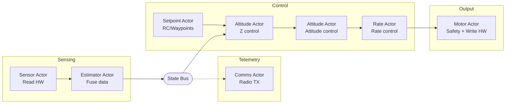

# Evolution

Production gaps, architecture evolution roadmap, and future extensions.

## Table of Contents

- [Production Gaps](#production-gaps)
- [Deferred Features](#deferred-features)
- [Architecture Evolution Roadmap](#architecture-evolution-roadmap)
- [Estimator Evolution](#estimator-evolution)
- [Future Extensions](#future-extensions)

---

## Production Gaps

What a production flight controller would need beyond this demonstration:

### Missing Error Handling

| Scenario | Current Behavior | Production Requirement |
|----------|------------------|------------------------|
| Sensor read fails | `hive_bus_read()` returns error, actor skips iteration | Watchdog timeout, switch to backup sensor or land |
| Bus publish fails | Error ignored | Log error, trigger failsafe |
| Actor crashes | Runtime notifies linked actors | Auto-restart or emergency landing |
| GPS signal lost | Position control uses stale data | Hold last position, descend slowly, or return-to-home |
| IMU data invalid | Garbage in, garbage out | Sanity checks, sensor voting, reject outliers |

### Implemented Safety Features

The following safety features run on all platforms (Webots and STM32):

| Feature | Location | Behavior |
|---------|----------|----------|
| Motor START gate | motor_actor.c | Motors stay OFF until flight_manager sends authorization |
| Crash latch | altitude_actor.c | Once attitude exceeds 45 deg, motors stay OFF until reboot |
| Attitude cutoff | altitude_actor.c | Motors off if roll or pitch >45 deg |
| Altitude cutoff | altitude_actor.c | Motors off if altitude >2m |
| Landed detection | altitude_actor.c | Motors off when target <5cm and altitude <15cm |
| Liftoff ramp | altitude_actor.c | Physics-based thrust ramp until rangefinder detects liftoff |
| Motor deadman | motor_actor.c | Motors zeroed if no torque command within 50ms |
| Flight duration | flight_manager_actor.c | Controlled landing after timeout (6-60s depending on flight profile) |
| Landing timeout | flight_manager_actor.c | Forces shutdown if landing detection fails (10s max) |
| Battery monitoring | battery_actor.c | 2 Hz voltage sampling, 3.2V warning, 3.0V critical with 5s debounce |
| Low battery landing | flight_manager_actor.c | Emergency landing on debounced critical voltage (ARMED: disarm, FLYING: land) |

The following safety features are STM32-only (disabled in Webots):

| Feature | Location | Behavior |
|---------|----------|----------|
| Startup delay | flight_manager_actor.c | Flight blocked by 15s grace period + 10s armed countdown (motors OFF) |

### Future Safety Features

The following may be added after initial flight testing:

- **Rate cutoff**: Motors off if angular rate exceeds threshold (e.g., >300 deg/s) - catches violent oscillation while within tilt limits
- **Accelerometer sanity check**: Motors off if acceleration readings are implausible
- **Sensor timeout**: Motors off if no sensor updates within expected interval

#### Bitcraze Supervisor (Reference)

The [Bitcraze supervisor](https://github.com/bitcraze/crazyflie-firmware/blob/master/src/modules/src/supervisor.c)
(local copy at `local/crazyflie-firmware/`) implements a comprehensive
11-state safety state machine. Key features worth adopting:

- **Tumble detection** - Z-accel < 0.5g for 1000ms, or < -0.2g for 100ms (upside-down)
- **Free fall exception** - Suspends tumble check when all axes < 0.1g
- **Commander watchdog** - Stale setpoint detection (500ms warning, 2s shutdown)
- **Warning Level Out** - On excessive tilt: disables XY, locks roll/pitch to zero, keeps Z

The current pilot has basic cutoffs in altitude_actor.c (attitude >45 deg,
altitude >2m). A dedicated supervisor actor could centralize these checks
and add the Bitcraze-style features above.

### Missing Safety Features (Production Requirements)

- **Geofence**: No boundary limits - drone can fly away indefinitely
- **Battery monitoring**: ~~No low-voltage warning or auto-land~~ IMPLEMENTED - battery_actor monitors at 2 Hz with debounced emergency landing
- **Arming/disarming**: No safety switch to prevent accidental motor start
- **Pre-flight checks**: No sensor validation before takeoff
- **Communication loss**: No failsafe if telemetry link drops

### Why These Are Omitted

This example focuses on demonstrating the actor runtime architecture, not building a safe drone. Adding proper failsafes would obscure the core concepts (actors, buses, control loops) with error handling code.

For a production system, each actor should:
1. Validate inputs before processing
2. Handle bus read/write failures
3. Implement timeouts for expected data
4. Report health status to a flight manager actor
5. Respond to emergency stop commands

### Production Instrumentation Requirements

The following instrumentation should be added for production flight software:

**Error Counters (per actor)**
- `bus_read_fail_count` - incremented when `hive_bus_read()` returns error
- `bus_publish_fail_count` - incremented when `hive_bus_publish()` returns error
- Counters exposed via telemetry or debug interface

**Motor Deadman Watchdog** - Implemented
- Motor actor uses `hive_select()` with `MOTOR_DEADMAN_TIMEOUT_MS` timeout (50ms)
- If no torque command received within timeout, all motors are zeroed
- Protects against controller actor crash leaving motors at last commanded value
- Timeout of 50ms (~12 control cycles at 250Hz) provides margin while remaining safe
- Logs warning on timeout: `[MOTOR] Deadman timeout - zeroing motors`

## Deferred Features

Features intentionally omitted or deferred:

- **Unified EKF** - See [Estimator Evolution](#estimator-evolution) below for the planned path from current 3-filter architecture to a full EKF
- **Failsafe handling** (return-to-home, auto-land) - requires GPS and mission planning
- **Multiple vehicle types** - single X-configuration quadcopter
- **Acrobatic flight modes** - requires EKF (complementary filter breaks at high angles)

**Note:** Runtime parameter tuning is now implemented. See `docs/tunable_radio_params.md`.

---

## Architecture Evolution Roadmap

This section documents how the architecture evolved from a monolithic design to the current
multi-actor implementation. Steps 1-11 are complete; Step 12 is future work.

### Future Architecture (Aspirational)

This simplified diagram shows the end-goal architecture including future features (Step 12).
The "Setpoint Actor" would replace the current Waypoint + Flight Manager pattern with a
unified setpoint source supporting RC input and mode switching.



### Step 1: Motor Actor
Separate motor output into dedicated actor.

```
Rate Actor ──► Torque Bus ──► Motor Actor ──► HAL ──► Hardware
                               (output)         (mixer)
```

**Features** - Subscribe to torque bus, call HAL for motor output. Mixer is in HAL.

> **Motor authority** - The motor actor is the sole writer to motor outputs. STOP notifications from flight manager override all torque commands and force outputs to zero. This single point of control prevents conflicting motor commands.

### Step 2: Separate Altitude Actor
Split altitude control from rate control.

```
Sensor Bus ──► Altitude Actor ──► Thrust Bus ──► Rate Actor ──► Torque Bus
            (altitude PID)                    (rate PIDs only)
```

**Benefits** Clear separation, different rates possible, easier tuning.

### Step 3: Sensor Actor
Move sensor reading from main loop into actor.

```
Main Loop: hal_step() + hive_advance_time() + hive_run_until_blocked()
Sensor Actor: timer ──► hal_read_sensors() ──► Sensor Bus
```

**Benefits** Main loop is minimal, all logic in timer-driven actors.

### Step 4: Attitude Actor
Add attitude angle control between altitude and rate control.

**Before**
```
Sensor Bus ──► Rate Actor (rate PIDs with hardcoded 0.0 setpoints)
```

**After**
```
Sensor Bus ──► Attitude Actor ──► Rate Setpoint Bus ──► Rate Actor
            (attitude PIDs)                          (rate PIDs)
```

**Benefits**
- Cascaded control (proper drone architecture)
- Attitude controller generates rate setpoints
- Rate controller tracks those setpoints
- Easier to tune each layer independently

### Step 5: Estimator Actor
Add sensor fusion between raw sensors and controllers.

**Before**
```
Sensor Actor ──► Sensor Bus ──► Controllers
```

**After**
```
Sensor Actor ──► Sensor Bus ──► Estimator Actor ──► State Bus ──► Controllers
                             (Kalman + complementary)
```

**Implementation**
- Complementary filter (`fusion/complementary_filter.c`) for attitude estimation
  - Fuses accelerometer and gyroscope for roll/pitch
  - Fuses magnetometer for yaw (when available)
- Altitude Kalman filter (`fusion/altitude_kf.c`) - 3-state [altitude, velocity, accel_bias]
  - Prediction: accelerometer (250 Hz), correction: rangefinder (~40 Hz)
- Horizontal Kalman filter (`fusion/horizontal_kf.c`) - 3-state per axis (X and Y)
  - Prediction: world-frame accelerometer (250 Hz), correction: optical flow velocity
  - Full rotation matrix (roll, pitch, yaw) for body-to-world acceleration
  - Innovation gating rejects flow outliers
- Webots: synthesizes accelerometer from gravity + inertial_unit angles

**Benefits**
- Controllers use state estimate, not raw sensors
- Derived values (velocities) computed in one place
- Fusion algorithm is portable (same code on all platforms)
- HALs are simpler (just raw sensor reads)

### Step 6: Position Actor
Add horizontal position hold and heading hold.

**Before**
```
Attitude Actor uses hardcoded 0.0 attitude setpoints
```

**After**
```
State Bus ──► Position Actor ──► Attitude Setpoint Bus ──► Attitude Actor
              (position PD)       (roll, pitch, yaw)    (attitude PIDs)
```

**Implementation**
- Simple PD controller: position error -> attitude command
- Velocity damping: reduces overshoot
- Max tilt limit: 0.35 rad (~20 deg) for safety
- Sign conventions match Bitcraze Webots controller
- Heading hold: publishes target yaw from waypoint actor
- Angle wrap-around: `pid_update_angle()` handles +/-pi discontinuity
- World-to-body frame transformation based on current yaw

**Benefits**
- Drone holds XY position and heading
- Returns to target when displaced or rotated
- Takes shortest rotation path (never rotates >180 deg)

### Step 7: Waypoint Actor
Add waypoint navigation with platform-specific routes.

**Before**
```
Altitude Actor uses hardcoded TARGET_ALTITUDE
Position Actor uses hardcoded TARGET_X, TARGET_Y, TARGET_YAW
```

**After**
```
                              ┌──► Altitude Actor (reads z)
State Bus ──► Waypoint Actor ──► Position Target Bus
              (navigation)       (x, y, z, yaw)
                              └──► Position Actor (reads x, y, yaw)
```

**Implementation**
- Manages list of waypoints (platform-specific)
- Publishes current target to position target bus
- Altitude actor reads target altitude from position target bus
- Position actor reads target XY and yaw from position target bus
- Monitors state bus for arrival detection
- Arrival requires: altitude, heading within tolerance, velocity below threshold
- Hovers briefly at each waypoint before advancing
- Loops forever: returns to first waypoint after completing route

**Platform-specific routes**
- **Webots** - 3D waypoints with square pattern and altitude changes
- **STM32 hardware** - Platform-dependent (see flight profiles in README.md)
- **First flight test** - Hover at 0.5m briefly, then land (safe tethered test)

**Benefits**
- Decouples waypoint logic from both position and altitude control
- Both actors read targets from bus (no hardcoded values)
- World-to-body frame transformation handles arbitrary headings
- Easy to extend with mission planning

### Step 8: Flight Manager Actor
Add centralized startup coordination and safety cutoff.

**Before**
```
Startup delay and flight window in motor_actor
Waypoint actor starts immediately
```

**After**
```
Flight Manager ──► START ──► Motor Actor (enables output)
               ──► START ──► Waypoint Actor (begins navigation)
                              │
                              v (flight begins)
               ──► LANDING ──► Altitude Actor
                              │
               ◄── LANDED ◄───┘ (touchdown detected)
                              │
               ──► STOP ────► Motor Actor
                              │
                              v (motors zeroed)
```

**Implementation**
- Handles 15s grace period + 10s armed countdown (motors stay OFF)
- Opens log file (erases flash sector on STM32)
- Sends START notification to motor actor (enables motor output)
- Sends START notification to waypoint actor to begin flight
- Periodic log sync every 4 seconds
- Flight duration per profile (6s/40s/60s)
- Sends LANDING notification to altitude actor
- Waits for LANDED notification (touchdown detected)
- Sends STOP notification to motor actor
- Closes log file

**Benefits**
- Centralized safety timing (not scattered across actors)
- Clear flight authorization flow
- Waypoint actor blocks until flight manager authorizes flight
- Easy to add pre-flight checks in one place

### Step 9: Comms Actor
Add radio telemetry for ground station logging (Crazyflie only).

**Before**
```
No real-time flight data logging during flight
```

**After**
```
State Bus ──┬──► Comms Actor ──► HAL Radio ──► Crazyradio 2.0 ──► Ground Station
Sensor Bus ─┤      (event-driven)
Thrust Bus ─┘
```

**Implementation**
- Subscribes to sensor, state, and thrust buses (not position target bus)
- Uses event-driven RX via `hive_event_wait(hal_esb_get_rx_event())` - no polling
- UART IDLE interrupt signals HAL event when packet arrives
- Sends binary packets over syslink protocol

**Packet limits** - ESB max payload is 32 bytes. HAL uses 1 byte for framing,
so max application payload is 30 bytes.

**Design choice** - Send all 24 tlog.csv columns over radio so ground station
produces CSV identical to SD card logger. Two packet types alternate, merged
on receive. Each packet includes a 32-bit timestamp (ms since boot).
Accel uses scale 100 (cm/s^2) for range; all other fields use scale 1000.
- Two operating modes:
  - Flight mode: Sends telemetry packets at 100Hz (alternating types at 50Hz each)
  - Download mode: Transfers flash log file to ground station on request
- Telemetry packet types (carry all 24 tlog.csv columns):
  - Type 0x03: tlog_state (29 bytes) - attitude, rates, position, velocity
  - Type 0x04: tlog_sensors (27 bytes) - thrust, targets, gyro, accel
- Log download packet types:
  - Type 0x10: CMD_REQUEST_LOG (ground -> drone)
  - Type 0x11: LOG_CHUNK (drone -> ground, 27 bytes data)
  - Type 0x12: LOG_COMPLETE (drone -> ground)
- Runs at LOW priority so control loops run first each cycle
- Radio send blocks ~370us (37 bytes * 10 bits/byte / 1Mbaud)
- Uses TEMPORARY restart (crash/exit doesn't trigger restarts of flight-critical actors)

**Ground station commands (from examples/pilot directory)**
```bash
pip install cflib
./tools/ground_station.py -o flight.csv        # Receive telemetry
./tools/ground_station.py --download-log log.txt  # Download log file (plain text)
cat log.txt                                     # View log directly
```

**Benefits**
- Real-time flight data for debugging and analysis
- Post-flight log download (no physical access required)
- Separate from flash logging (higher rate, no flash wear)
- Non-intrusive (LOW priority doesn't affect control loops)

### Step 10: Logger Actor
Add CSV logging for PID tuning and flight analysis.

**Before**
```
No structured data export for analysis
```

**After**
```
State Bus ──┬──► Logger ──► /sd/tlog.csv or /tmp/tlog.csv
Sensor Bus ─┤      (25Hz)
Thrust Bus ─┤
Position Target Bus ─┘
```

**Implementation**
- Subscribes to sensor, state, thrust, and position target buses
- Writes CSV at 25Hz with all flight data
- Storage selected at runtime via `hive_file_mount_available()`:
  - Prefers `/sd` (Crazyflie with SD card deck, build with `ENABLE_SD=1`)
  - Falls back to `/tmp` (Webots simulation)
  - Exits gracefully if no storage available
- Filename: `tlog.csv` (8.3 compatible for SD card)
- Runs at LOW priority, TEMPORARY restart (not flight-critical)
- Flushes to disk every second (25 samples)

**CSV columns**
- `time_ms`: Timestamp since flight start
- `roll,pitch,yaw`: Attitude angles (rad)
- `roll_rate,pitch_rate,yaw_rate`: Angular rates (rad/s)
- `x,y,altitude`: Position (m)
- `vx,vy,vz`: Velocities (m/s)
- `thrust`: Thrust command (normalized)
- `target_x,target_y,target_z,target_yaw`: Position targets
- `gyro_x,gyro_y,gyro_z`: Raw gyro (rad/s)
- `accel_x,accel_y,accel_z`: Raw accel (m/s^2)

**Usage**
```bash
# Run simulation (make now auto-installs to Webots)
make
webots worlds/hover_test.wbt

# Analyze PID performance
python3 tools/analyze_pid.py /tmp/tlog.csv

# Visualize telemetry (6-panel plot)
python3 tools/plot_telemetry.py /tmp/tlog.csv

# Full flight summary with 3D trajectory
python3 tools/plot_flight.py /tmp/tlog.csv
```

**Benefits**
- Data-driven PID tuning (vs blind iteration)
- Visualize oscillations, overshoot, settling time
- Quantitative metrics: rise time, settling time, RMS error
- Compare before/after gain changes
- Non-intrusive (LOW priority doesn't affect control loops)

### Step 11: Battery Actor
Add in-flight battery monitoring with debounced emergency landing.

**Before**
```
Battery voltage logged once at startup, included in telemetry packets.
No autonomic action on low voltage.
```

**After**
```
Battery Actor ──► (2 Hz timer) ──► hal_power_get_battery()
                                       │
                                       v (voltage < 3.0V, 10 consecutive readings)
                    ──► LOW_BATTERY ──► Flight Manager
                                           │
                                           v (ARMED: disarm, FLYING: land)
```

**Implementation**
- 2 Hz sampling via periodic timer (500ms interval)
- Two-tier thresholds matching Bitcraze pm_stm32f4.c:
  - WARNING: 3.2V - log WARN once
  - CRITICAL: 3.0V - 10 consecutive readings (5s debounce)
- On debounced critical: sends NOTIFY_LOW_BATTERY to flight_manager (once)
- Flight manager handles LOW_BATTERY in two states:
  - ARMED: cancel countdown, disarm motors, return to IDLE
  - FLYING: initiate controlled landing (same path as flight timer expiry)
- Handles NOTIFY_RESET from flight_manager (resets debounce state)
- LOW priority, TEMPORARY restart, pool_block=true

**Debounce rationale** - Motor load causes voltage sag of 0.2-0.5V during
aggressive maneuvers. Without debouncing, transient sag would trigger false
critical alerts. 10 consecutive readings at 2 Hz (5 seconds) matches Bitcraze.

**On simulation** - `hal_power_get_battery()` returns 4.2V always, so the
actor runs harmlessly (never triggers). This exercises the code path without
affecting simulation behavior.

**Benefits**
- Prevents crash from depleted battery (controlled landing instead)
- Matches Bitcraze's proven thresholds and debounce timing
- Decoupled from control loop (LOW priority, IPC to flight_manager)
- Flight_manager decides action based on current state (no motor commands from battery actor)

### Step 12 (Future): RC Input / Mode Switching

Replace the waypoint actor's fixed route with a setpoint source that supports
multiple input modes:

- **RC input** - Manual control override via CPPM/SBUS receiver
- **Mode switching** - Hover, land, return-to-home, follow-me
- **Dynamic waypoints** - Upload waypoints via radio during flight
- **Takeoff/landing sequences** - Automated sequences triggered by RC switch

This would evolve the waypoint actor into a "setpoint actor" (shown in the
Future Architecture diagram above).

---

## Estimator Evolution

The current estimator uses three independent filters. This section documents
the path toward a unified EKF for acrobatic flight.

### Current Architecture (3 filters)

```
Accelerometer ──► Complementary Filter ──► roll, pitch, yaw
Gyroscope     ──┘

Accelerometer ──► Altitude KF (3-state) ──► altitude, vz, accel_bias_z
Rangefinder   ──┘

Accelerometer ──► Horizontal KF (3-state x2) ──► x, y, vx, vy, bias_x, bias_y
Optical Flow  ──┘
```

Total: 9 states across 3 filters, ~20 lines of matrix math each.

**Strengths**
- Simple, debuggable, each filter tuneable independently
- Complementary filter is computationally cheap (~10us per update)
- Adequate for gentle hover and slow waypoint navigation

**Comparison with Bitcraze firmware**

| Component | Hive pilot | Bitcraze firmware |
|-----------|-----------|-------------------|
| Attitude | Complementary filter | Extended Kalman Filter |
| Altitude | 3-state KF | Part of full EKF |
| Horizontal velocity | 3-state KF | EKF-fused with accel |
| Horizontal position | KF-integrated | EKF-fused |
| Position control | PD (no integral) | PID with feedforward |

**Limitation** - The complementary filter computes roll and pitch from the
gravity vector in accelerometer data. This assumes acceleration is dominated
by gravity, which breaks during aggressive maneuvers (>30 deg tilt, rapid
translation). The horizontal KF also uses a small-angle rotation matrix
that degrades at high tilt.

### Future Architecture (unified EKF)

A full Extended Kalman Filter would fuse all sensors in a single ~15-state
model:

```
State vector (15-16 states):
  Attitude:  quaternion (4) or rotation matrix
  Position:  x, y, z (3)
  Velocity:  vx, vy, vz (3)
  Gyro bias: bwx, bwy, bwz (3)
  Accel bias: bax, bay, baz (3)

Measurements:
  Accelerometer (250 Hz) - gravity + linear acceleration
  Gyroscope (250 Hz)     - angular rate (prediction step)
  Rangefinder (~40 Hz)   - altitude
  Optical flow (~100 Hz) - horizontal velocity
  Magnetometer (future)  - heading
```

**Why EKF matters for acrobatics** - The quaternion state tracks orientation
through arbitrary rotations (flips, rolls, inverted flight). No singularity
at 90 deg pitch, no gravity assumption for tilt estimation. Gyro bias
estimation compensates for sensor drift that would accumulate during extended
maneuvers.

### Implementation Plan

**Compile-time switch** - Add `ESTIMATOR_MODE` build flag:
- `ESTIMATOR_3FILTER` (default) - Current complementary + altitude KF + horizontal KF
- `ESTIMATOR_EKF` - Unified EKF

Both modes use the same actor interface (read sensor bus, publish state bus).
No changes to any other actor. The estimator actor already isolates all
fusion logic behind the state bus abstraction.

**What carries forward** - Inner loop tuning (rate PID, attitude PID) is
independent of the estimator. The PIDs consume the same state bus fields
regardless of which estimator produced them. Only the outer loops (position,
altitude) may need gain adjustments because EKF velocity estimates will have
different noise characteristics.

**Effort estimate** - 2-4 weeks for a working EKF:
- Quaternion math library (~200 lines)
- EKF predict/update with 15x15 covariance (~400 lines)
- Sensor measurement models (~100 lines each)
- Tuning Q/R matrices (iterative, data-driven)

---

## Future Extensions

1. **Mission planning** - Load waypoints from file, complex routes
2. **Sensor fusion** - [DONE] Complementary filter (attitude) + altitude KF + horizontal KF. See [Estimator Evolution](#estimator-evolution) for EKF path
3. **Failsafe** - Motor failure detection, emergency landing
4. **Telemetry** - [DONE] Radio telemetry implemented (Crazyflie only)
5. **RC input** - Manual control override
6. **Setpoint actor** - Altitude command generation, mode switching
7. **Bus retention on subscribe** - Late subscribers immediately receive most recent value (useful after supervisor restart). Current behavior: wait for next publish cycle, acceptable for high-frequency buses (< 4ms delay at 250Hz)
8. **SD card logging** - [DONE] High-volume telemetry logging via Micro SD Card Deck (SPI, FAT32). Build with `ENABLE_SD=1`. See `hal/crazyflie-2.1plus/README.md` for details
