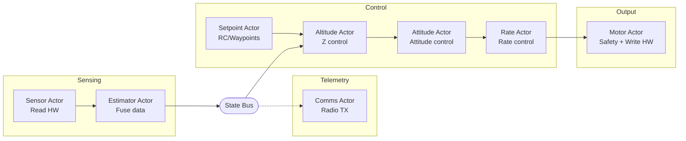

# Evolution

Production gaps, architecture evolution roadmap, and future extensions.

## Table of Contents

- [Production Gaps](#production-gaps)
- [Deferred Features](#deferred-features)
- [Architecture Evolution Roadmap](#architecture-evolution-roadmap)
- [Future Extensions](#future-extensions)

---

## Production Gaps

What a production flight controller would need beyond this demonstration:

### Missing Error Handling

| Scenario | Current Behavior | Production Requirement |
|----------|------------------|------------------------|
| Sensor read fails | `hive_bus_read()` returns error, actor skips iteration | Watchdog timeout, switch to backup sensor or land |
| Bus publish fails | Error ignored | Log error, trigger failsafe |
| Actor crashes | Runtime notifies linked actors | Auto-restart or emergency landing |
| GPS signal lost | Position control uses stale data | Hold last position, descend slowly, or return-to-home |
| IMU data invalid | Garbage in, garbage out | Sanity checks, sensor voting, reject outliers |

### Implemented Safety Features

The following safety features run on all platforms (Webots and STM32):

| Feature | Location | Behavior |
|---------|----------|----------|
| Attitude cutoff | altitude_actor.c | Motors off if roll or pitch >45 deg |
| Altitude cutoff | altitude_actor.c | Motors off if altitude >2m |
| Landed detection | altitude_actor.c | Motors off when target <5cm and altitude <15cm |
| Thrust ramp | altitude_actor.c | Gradual thrust increase over 0.5 seconds on takeoff |
| Motor deadman | motor_actor.c | Motors zeroed if no torque command within 50ms |
| Flight duration | flight_manager_actor.c | Controlled landing after timeout (10-60s depending on flight profile) |

The following safety features are STM32-only (disabled in Webots):

| Feature | Location | Behavior |
|---------|----------|----------|
| Startup delay | flight_manager_actor.c | Flight blocked for 60 seconds after boot |

### Future Safety Features

The following may be added after initial flight testing:

- **Rate cutoff**: Motors off if angular rate exceeds threshold (e.g., >300 deg/s) - catches violent oscillation while within tilt limits
- **Accelerometer sanity check**: Motors off if acceleration readings are implausible
- **Sensor timeout**: Motors off if no sensor updates within expected interval

### Missing Safety Features (Production Requirements)

- **Geofence**: No boundary limits - drone can fly away indefinitely
- **Battery monitoring**: No low-voltage warning or auto-land
- **Arming/disarming**: No safety switch to prevent accidental motor start
- **Pre-flight checks**: No sensor validation before takeoff
- **Communication loss**: No failsafe if telemetry link drops

### Why These Are Omitted

This example focuses on demonstrating the actor runtime architecture, not building a safe drone. Adding proper failsafes would obscure the core concepts (actors, buses, control loops) with error handling code.

For a production system, each actor should:
1. Validate inputs before processing
2. Handle bus read/write failures
3. Implement timeouts for expected data
4. Report health status to a flight manager actor
5. Respond to emergency stop commands

### Production Instrumentation Requirements

The following instrumentation should be added for production flight software:

**Error Counters (per actor)**
- `bus_read_fail_count` - incremented when `hive_bus_read()` returns error
- `bus_publish_fail_count` - incremented when `hive_bus_publish()` returns error
- Counters exposed via telemetry or debug interface

**Motor Deadman Watchdog** - Implemented
- Motor actor uses `hive_select()` with `MOTOR_DEADMAN_TIMEOUT_MS` timeout (50ms)
- If no torque command received within timeout, all motors are zeroed
- Protects against controller actor crash leaving motors at last commanded value
- Timeout of 50ms (~12 control cycles at 250Hz) provides margin while remaining safe
- Logs warning on timeout: `[MOTOR] Deadman timeout - zeroing motors`

## Deferred Features

Features intentionally omitted from this demonstration:

- Unified EKF (single filter for position/velocity/attitude) -separate estimators used instead: altitude Kalman filter + complementary filter for attitude
- Failsafe handling (return-to-home, auto-land) -requires GPS and mission planning
- Parameter tuning UI -gains are hardcoded per platform
- Multiple vehicle types -single X-configuration quadcopter

---

## Architecture Evolution Roadmap

This section documents how the architecture evolved from a monolithic design to the current
multi-actor implementation. Steps 1-10 are complete; Step 11 is future work.

### Future Architecture (Aspirational)

This simplified diagram shows the end-goal architecture including future features (Step 11).
The "Setpoint Actor" would replace the current Waypoint + Flight Manager pattern with a
unified setpoint source supporting RC input and mode switching.



### Step 1: Motor Actor
Separate motor output into dedicated actor.

```
Rate Actor ──► Torque Bus ──► Motor Actor ──► HAL ──► Hardware
                               (output)         (mixer)
```

**Features** - Subscribe to torque bus, call HAL for motor output. Mixer is in HAL.

> **Motor authority** - The motor actor is the sole writer to motor outputs. STOP notifications from flight manager override all torque commands and force outputs to zero. This single point of control prevents conflicting motor commands.

### Step 2: Separate Altitude Actor
Split altitude control from rate control.

```
Sensor Bus ──► Altitude Actor ──► Thrust Bus ──► Rate Actor ──► Torque Bus
            (altitude PID)                    (rate PIDs only)
```

**Benefits** Clear separation, different rates possible, easier tuning.

### Step 3: Sensor Actor
Move sensor reading from main loop into actor.

```
Main Loop: hal_step() + hive_advance_time() + hive_run_until_blocked()
Sensor Actor: timer ──► hal_read_sensors() ──► Sensor Bus
```

**Benefits** Main loop is minimal, all logic in timer-driven actors.

### Step 4: Attitude Actor
Add attitude angle control between altitude and rate control.

**Before**
```
Sensor Bus ──► Rate Actor (rate PIDs with hardcoded 0.0 setpoints)
```

**After**
```
Sensor Bus ──► Attitude Actor ──► Rate Setpoint Bus ──► Rate Actor
            (attitude PIDs)                          (rate PIDs)
```

**Benefits**
- Cascaded control (proper drone architecture)
- Attitude controller generates rate setpoints
- Rate controller tracks those setpoints
- Easier to tune each layer independently

### Step 5: Estimator Actor
Add sensor fusion between raw sensors and controllers.

**Before**
```
Sensor Actor ──► Sensor Bus ──► Controllers
```

**After**
```
Sensor Actor ──► Sensor Bus ──► Estimator Actor ──► State Bus ──► Controllers
                             (Kalman + complementary)
```

**Implementation**
- Altitude Kalman filter (`fusion/altitude_kf.c`) for altitude/velocity estimation
- Complementary filter (`fusion/complementary_filter.c`) for attitude estimation
- Fuses accelerometer and gyroscope for roll/pitch estimation
- Fuses magnetometer for yaw (when available)
- Webots: synthesizes accelerometer from gravity + inertial_unit angles

**Benefits**
- Controllers use state estimate, not raw sensors
- Derived values (velocities) computed in one place
- Fusion algorithm is portable (same code on all platforms)
- HALs are simpler (just raw sensor reads)

### Step 6: Position Actor
Add horizontal position hold and heading hold.

**Before**
```
Attitude Actor uses hardcoded 0.0 attitude setpoints
```

**After**
```
State Bus ──► Position Actor ──► Attitude Setpoint Bus ──► Attitude Actor
              (position PD)       (roll, pitch, yaw)    (attitude PIDs)
```

**Implementation**
- Simple PD controller: position error -> attitude command
- Velocity damping: reduces overshoot
- Max tilt limit: 0.35 rad (~20 deg) for safety
- Sign conventions match Bitcraze Webots controller
- Heading hold: publishes target yaw from waypoint actor
- Angle wrap-around: `pid_update_angle()` handles +/-pi discontinuity
- World-to-body frame transformation based on current yaw

**Benefits**
- Drone holds XY position and heading
- Returns to target when displaced or rotated
- Takes shortest rotation path (never rotates >180 deg)

### Step 7: Waypoint Actor
Add waypoint navigation with platform-specific routes.

**Before**
```
Altitude Actor uses hardcoded TARGET_ALTITUDE
Position Actor uses hardcoded TARGET_X, TARGET_Y, TARGET_YAW
```

**After**
```
                              ┌──► Altitude Actor (reads z)
State Bus ──► Waypoint Actor ──► Position Target Bus
              (navigation)       (x, y, z, yaw)
                              └──► Position Actor (reads x, y, yaw)
```

**Implementation**
- Manages list of waypoints (platform-specific)
- Publishes current target to position target bus
- Altitude actor reads target altitude from position target bus
- Position actor reads target XY and yaw from position target bus
- Monitors state bus for arrival detection
- Arrival requires: altitude, heading within tolerance, velocity below threshold
- Hovers briefly at each waypoint before advancing
- Loops forever: returns to first waypoint after completing route

**Platform-specific routes**
- **Webots** - 3D waypoints with square pattern and altitude changes
- **STM32 hardware** - Platform-dependent (see flight profiles in README.md)
- **First flight test** - Hover at 0.5m briefly, then land (safe tethered test)

**Benefits**
- Decouples waypoint logic from both position and altitude control
- Both actors read targets from bus (no hardcoded values)
- World-to-body frame transformation handles arbitrary headings
- Easy to extend with mission planning

### Step 8: Flight Manager Actor
Add centralized startup coordination and safety cutoff.

**Before**
```
Startup delay and flight window in motor_actor
Waypoint actor starts immediately
```

**After**
```
Flight Manager ──► START ──► Waypoint Actor
                              │
                              v (flight begins)
               ──► LANDING ──► Altitude Actor
                              │
               ◄── LANDED ◄───┘ (touchdown detected)
                              │
               ──► STOP ────► Motor Actor
                              │
                              v (motors zeroed)
```

**Implementation**
- Handles 60-second startup delay (hardware only)
- Opens log file (erases flash sector on STM32)
- Sends START notification to waypoint actor to begin flight
- Periodic log sync every 4 seconds
- Flight duration per profile (10s/40s/60s)
- Sends LANDING notification to altitude actor
- Waits for LANDED notification (touchdown detected)
- Sends STOP notification to motor actor
- Closes log file

**Benefits**
- Centralized safety timing (not scattered across actors)
- Clear flight authorization flow
- Waypoint actor blocks until flight manager authorizes flight
- Easy to add pre-flight checks in one place

### Step 9: Comms Actor
Add radio telemetry for ground station logging (Crazyflie only).

**Before**
```
No real-time flight data logging during flight
```

**After**
```
State Bus ──┬──► Comms Actor ──► HAL Radio ──► Crazyradio 2.0 ──► Ground Station
Sensor Bus ─┤      (100Hz)
Thrust Bus ─┘
```

**Implementation**
- Subscribes to sensor, state, and thrust buses (not position target bus)
- Sends binary packets at 100Hz over syslink protocol

**Constraint** - ESB payload limit is 31 bytes per packet.

**Design choice** - Prioritize attitude, rates, and thrust in telemetry packets. Position targets are omitted due to packet size limit--use Webots CSV telemetry for position control tuning. A future revision could add a third packet type for targets if needed.
- Two operating modes:
  - Flight mode: Sends telemetry packets at 100Hz
  - Download mode: Transfers flash log file to ground station on request
- Telemetry packet types (31-byte ESB limit):
  - Type 0x01: Attitude/rates (gyro XYZ, roll/pitch/yaw)
  - Type 0x02: Position (altitude, velocities, thrust)
- Log download packet types:
  - Type 0x10: CMD_REQUEST_LOG (ground -> drone)
  - Type 0x11: LOG_CHUNK (drone -> ground, 28 bytes data)
  - Type 0x12: LOG_COMPLETE (drone -> ground)
- Runs at LOW priority so control loops run first each cycle
- Radio send blocks ~370us (37 bytes * 10 bits/byte / 1Mbaud)
- Uses TEMPORARY restart (crash/exit doesn't trigger restarts of flight-critical actors)

**Ground station commands (from examples/pilot directory)**
```bash
pip install cflib
./tools/ground_station.py -o flight.csv        # Receive telemetry
./tools/ground_station.py --download-log log.bin  # Download log file
../../tools/decode_log.py log.bin > log.txt    # Decode binary log
```

**Benefits**
- Real-time flight data for debugging and analysis
- Post-flight log download (no physical access required)
- Separate from flash logging (higher rate, no flash wear)
- Non-intrusive (LOW priority doesn't affect control loops)

### Step 10: Telemetry Logger Actor
Add CSV logging for PID tuning and flight analysis (Webots only).

**Before**
```
No structured data export for analysis
```

**After**
```
State Bus ──┬──► Telemetry Logger ──► /tmp/pilot_telemetry.csv
Sensor Bus ─┤      (25Hz)
Thrust Bus ─┤
Position Target Bus ─┘
```

**Implementation**
- Subscribes to sensor, state, thrust, and position target buses
- Writes CSV at 25Hz with all flight data
- Enabled by default for Webots (`SIMULATED_TIME`), disabled for Crazyflie
- Log path passed via `telemetry_logger_config` struct at spawn time
- Runs at LOW priority, TEMPORARY restart (not flight-critical)
- Flushes to disk every second (25 samples)

**CSV columns**
- `time_ms`: Timestamp since flight start
- `roll,pitch,yaw`: Attitude angles (rad)
- `roll_rate,pitch_rate,yaw_rate`: Angular rates (rad/s)
- `x,y,altitude`: Position (m)
- `vx,vy,vz`: Velocities (m/s)
- `thrust`: Thrust command (normalized)
- `target_x,target_y,target_z,target_yaw`: Position targets
- `gyro_x,gyro_y,gyro_z`: Raw gyro (rad/s)
- `accel_x,accel_y,accel_z`: Raw accel (m/s^2)

**Usage**
```bash
# Run simulation (make now auto-installs to Webots)
make
webots worlds/hover_test.wbt

# Analyze PID performance
python3 tools/analyze_pid.py /tmp/pilot_telemetry.csv

# Visualize telemetry (6-panel plot)
python3 tools/plot_telemetry.py /tmp/pilot_telemetry.csv

# Full flight summary with 3D trajectory
python3 tools/plot_flight.py /tmp/pilot_telemetry.csv
```

**Benefits**
- Data-driven PID tuning (vs blind iteration)
- Visualize oscillations, overshoot, settling time
- Quantitative metrics: rise time, settling time, RMS error
- Compare before/after gain changes
- Non-intrusive (LOW priority doesn't affect control loops)

### Step 11 (Future): RC Input / Mode Switching

**Future extensions**
- RC input handling (manual override)
- Takeoff/landing sequences
- Mode switching (hover, land, follow-me, etc.)
- Dynamic waypoint updates via telemetry

---

## Future Extensions

1. **Mission planning** - Load waypoints from file, complex routes
2. **Sensor fusion** - [DONE] Altitude Kalman filter + attitude complementary filter (estimator actor)
3. **Failsafe** - Motor failure detection, emergency landing
4. **Telemetry** - [DONE] Radio telemetry implemented (Crazyflie only)
5. **RC input** - Manual control override
6. **Setpoint actor** - Altitude command generation, mode switching
7. **Bus retention on subscribe** - Late subscribers immediately receive most recent value (useful after supervisor restart). Current behavior: wait for next publish cycle, acceptable for high-frequency buses (< 4ms delay at 250Hz)
8. **SD card logging** - High-volume telemetry logging via Micro SD Card Deck (SPI, FAT32). Removes flash wear/size constraints for flight data recording
